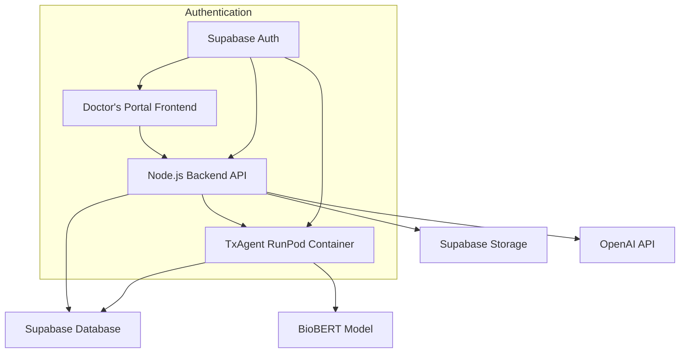
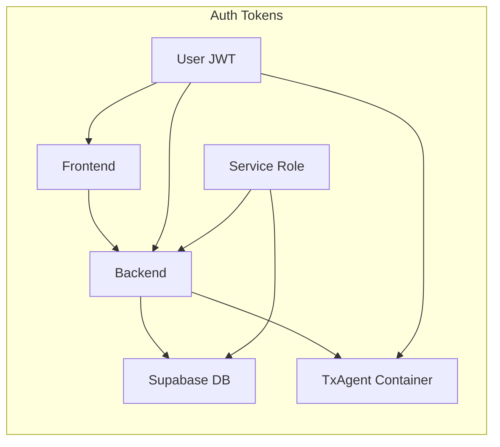

# COMPANION_CONTEXT.md - Medical RAG Doctor's Portal

This document describes the **Medical RAG Vector Uploader** system - a comprehensive doctor's portal for medical document processing and AI-powered chat consultation using TxAgent containerized AI.

## 🎯 **System Overview**

The Medical RAG Doctor's Portal is a production-ready web application that enables medical professionals to:

- **Upload and process medical documents** (PDFs, DOCX, TXT, MD) with automatic text extraction and embedding generation
- **Chat with AI agents** (TxAgent BioBERT or OpenAI GPT-4) using uploaded documents as context
- **Manage RunPod containerized TxAgent sessions** with real-time health monitoring
- **Search and manage document libraries** with vector similarity search
- **Monitor system health** with comprehensive agent status tracking

## 🏗️ **Architecture**



### **Components**

- **Frontend**: React + TypeScript + Vite (SPA)
- **Backend**: Node.js + Express (RESTful API)
- **Database**: Supabase PostgreSQL with pgvector
- **Storage**: Supabase Storage with RLS
- **AI Container**: RunPod TxAgent with BioBERT
- **Authentication**: Supabase Auth with JWT tokens

## 🗄️ **Database Schema**

### **Core Tables**

#### **documents** - Vector Document Storage

```sql
CREATE TABLE public.documents (
    id UUID PRIMARY KEY DEFAULT gen_random_uuid(),
    filename TEXT NOT NULL,
    content TEXT NOT NULL,                    -- Extracted text content
    embedding VECTOR(768),                   -- BioBERT 768-dimensional embedding
    metadata JSONB DEFAULT '{}'::JSONB,      -- File metadata and processing info
    user_id UUID NOT NULL REFERENCES auth.users(id) ON DELETE CASCADE,
    created_at TIMESTAMPTZ DEFAULT now()
);

-- Optimized indexes for vector search
CREATE INDEX documents_embedding_idx ON public.documents
USING ivfflat (embedding vector_cosine_ops) WITH (lists='100');
```

#### **agents** - TxAgent Session Management

```sql
CREATE TABLE public.agents (
    id UUID PRIMARY KEY DEFAULT gen_random_uuid(),
    user_id UUID NOT NULL REFERENCES auth.users(id) ON DELETE CASCADE,
    status TEXT DEFAULT 'initializing'::TEXT,  -- 'active', 'terminated', 'initializing'
    session_data JSONB DEFAULT '{}'::JSONB,    -- Container details, endpoints, capabilities
    created_at TIMESTAMPTZ DEFAULT now(),
    last_active TIMESTAMPTZ DEFAULT now(),
    terminated_at TIMESTAMPTZ
);
```

#### **embedding_jobs** - Processing Job Tracking

```sql
CREATE TABLE public.embedding_jobs (
    id UUID PRIMARY KEY DEFAULT gen_random_uuid(),
    file_path TEXT NOT NULL,                  -- Supabase Storage path
    status TEXT DEFAULT 'pending'::TEXT,      -- 'pending', 'processing', 'completed', 'failed'
    metadata JSONB DEFAULT '{}'::JSONB,
    chunk_count INTEGER DEFAULT 0,
    error TEXT,
    user_id UUID NOT NULL REFERENCES auth.users(id) ON DELETE CASCADE,
    created_at TIMESTAMPTZ DEFAULT now(),
    updated_at TIMESTAMPTZ DEFAULT now()
);
```

### **Row Level Security (RLS)**

#### **Shared Knowledge Base Pattern**

```sql
-- Documents: All doctors can read all medical documents (shared knowledge)
CREATE POLICY "All authenticated users can read all documents"
    ON public.documents FOR SELECT TO authenticated
    USING (true);

-- Users can only upload as themselves
CREATE POLICY "Users can only upload as themselves"
    ON public.documents FOR INSERT TO authenticated
    WITH CHECK (auth.uid() = user_id);

-- Agent sessions: Users manage only their own agents
CREATE POLICY "Users can manage own agents"
    ON public.agents FOR ALL TO authenticated
    USING (user_id = auth.uid()) WITH CHECK (user_id = auth.uid());
```

## 🔐 **Authentication Architecture**

### **Dual Authentication Pattern**



#### **Frontend → Backend**

- **User JWT**: Supabase authentication token from user login
- **Headers**: `Authorization: Bearer <user_jwt_token>`
- **Validation**: Backend validates JWT with `SUPABASE_JWT_SECRET`

#### **Backend → Supabase**

- **Service Role**: Backend uses service role key for admin operations
- **Operations**: File uploads, RLS-bypassed operations, admin queries

#### **Backend → TxAgent**

- **User JWT**: Backend forwards user JWT to container
- **Operations**: Chat, embedding, health checks with user context

### **JWT Token Flow**

```typescript
// Frontend stores JWT from Supabase Auth
localStorage.setItem(
  "sb-project-auth-token",
  JSON.stringify({
    access_token: "jwt_token_here",
    user: {
      /* user data */
    },
  })
);

// Axios interceptor automatically adds JWT to all requests
api.interceptors.request.use((config) => {
  const token = getStoredToken();
  if (token) {
    config.headers.Authorization = `Bearer ${token}`;
  }
  return config;
});
```

## 🔌 **API Endpoints**

### **Document Management**

#### **File Upload**

```http
POST /upload
Authorization: Bearer <user_jwt>
Content-Type: multipart/form-data
Body: FormData with 'file' field

Response:
{
  "message": "File uploaded successfully",
  "file_path": "user-id/timestamp_filename.pdf",
  "job_id": "uuid-string",
  "poll_url": "/api/documents/job-status/uuid-string"
}
```

#### **Job Status Polling**

```http
GET /api/documents/job-status/{job_id}
Authorization: Bearer <user_jwt>

Response:
{
  "job_id": "uuid-string",
  "status": "completed", // "pending" | "processing" | "completed" | "failed"
  "chunk_count": 15,
  "created_at": "2024-01-01T00:00:00Z",
  "updated_at": "2024-01-01T00:05:00Z",
  "error": null
}
```

### **Agent Management**

#### **Agent Status**

```http
GET /api/agent/status
Authorization: Bearer <user_jwt>

Response:
{
  "agent_active": true,
  "agent_id": "uuid-string",
  "last_active": "2024-01-01T00:00:00Z",
  "container_status": "running",
  "session_data": {
    "container_id": "runpod-container-id",
    "started_at": "2024-01-01T00:00:00Z",
    "capabilities": ["chat", "embed", "health"]
  }
}
```

#### **Start Agent Session**

```http
POST /api/agent/start
Authorization: Bearer <user_jwt>

Response:
{
  "agent_id": "uuid-string",
  "status": "active",
  "session_data": {
    "container_id": "runpod-container-id",
    "runpod_endpoint": "https://container-url.runpod.net",
    "started_at": "2024-01-01T00:00:00Z",
    "capabilities": ["chat", "embed", "health"]
  }
}
```

#### **Stop Agent Session**

```http
POST /api/agent/stop
Authorization: Bearer <user_jwt>

Response:
{
  "success": true,
  "message": "Agent session terminated successfully"
}
```

#### **Health Check**

```http
POST /api/agent/test-health
Authorization: Bearer <user_jwt>

Response:
{
  "container_reachable": true,
  "endpoints_working": true,
  "test_results": {
    "health": { "status": 200, "response": {...} },
    "chat": { "status": 200, "response": {...} },
    "embed": { "status": 200, "response": {...} }
  }
}
```

### **Chat Endpoints**

#### **TxAgent Chat (Primary)**

```http
POST /api/chat
Authorization: Bearer <user_jwt>
Content-Type: application/json

Body:
{
  "message": "What are the symptoms of myocardial infarction?",
  "top_k": 5,
  "temperature": 0.7
}

Response:
{
  "response": "Myocardial infarction symptoms include chest pain, shortness of breath...",
  "sources": [
    {
      "filename": "cardiology-guidelines.pdf",
      "content": "Relevant excerpt...",
      "similarity": 0.89,
      "metadata": { "page": 15 }
    }
  ],
  "agent_id": "txagent",
  "processing_time": 1250,
  "model": "BioBERT",
  "status": "success"
}
```

#### **OpenAI Chat (Fallback)**

```http
POST /api/openai-chat
Authorization: Bearer <user_jwt>
Content-Type: application/json

Body:
{
  "message": "What are the symptoms of myocardial infarction?",
  "context": [] // Previous conversation context
}

Response:
{
  "response": "Based on medical literature...",
  "sources": [...],
  "agent_id": "openai",
  "model": "gpt-4",
  "tokens_used": 150
}
```

### **Embedding Generation**

```http
POST /api/embed
Authorization: Bearer <user_jwt>
Content-Type: application/json

Body:
{
  "text": "Patient presents with chest pain and dyspnea",
  "normalize": true
}

Response:
{
  "embedding": [0.1234, -0.5678, 0.9012, ...], // 768 dimensions
  "dimensions": 768,
  "model": "BioBERT",
  "processing_time": 45
}
```

## 🤖 **TxAgent Container Integration**

### **Container Requirements**

The TxAgent RunPod container must implement these endpoints:

#### **Health Endpoint**

```http
GET /health

Expected Response:
{
  "status": "healthy",
  "model": "BioBERT",
  "device": "cuda:0",
  "version": "1.0.0",
  "uptime": 3600
}
```

#### **Chat Endpoint**

```http
POST /chat
Authorization: Bearer <user_jwt>
Content-Type: application/json

Body:
{
  "query": "What is diabetes?",    // CRITICAL: 'query' not 'message'
  "top_k": 5,
  "temperature": 0.7,
  "history": [],
  "stream": false
}

Expected Response:
{
  "response": "Diabetes is a metabolic disorder...",
  "sources": [...],
  "processing_time": 1250,
  "model": "BioBERT"
}
```

#### **Embedding Endpoint**

```http
POST /embed
Authorization: Bearer <user_jwt>
Content-Type: application/json

Body:
{
  "text": "medical text here",
  "normalize": true
}

Expected Response:
{
  "embedding": [...], // MUST be exactly 768 dimensions
  "dimensions": 768,
  "model": "BioBERT"
}
```

### **Integration Flow**

1. **Doctor starts agent** → Backend creates session in `agents` table
2. **Backend gets container endpoint** → Stored in `session_data.runpod_endpoint`
3. **Doctor sends chat message** → Backend proxies to container `/chat`
4. **Container processes query** → Uses BioBERT for embeddings and chat
5. **Backend returns response** → Includes sources and metadata

## 🧪 **Testing & Validation**

### **Health Check Sequence**

```bash
# 1. Test backend health
curl https://your-app.com/health

# 2. Test agent status
curl -H "Authorization: Bearer JWT" https://your-app.com/api/agent/status

# 3. Test container health
curl -H "Authorization: Bearer JWT" https://your-app.com/api/agent/test-health

# 4. Test chat functionality
curl -X POST -H "Authorization: Bearer JWT" \
     -H "Content-Type: application/json" \
     -d '{"message":"test query"}' \
     https://your-app.com/api/chat
```

### **Upload Testing**

```bash
# Test file upload
curl -X POST -H "Authorization: Bearer JWT" \
     -F "file=@medical-document.pdf" \
     https://your-app.com/upload

# Poll job status
curl -H "Authorization: Bearer JWT" \
     https://your-app.com/api/documents/job-status/{job_id}
```

## 🔧 **Configuration**

### **Backend Environment (.env)**

```bash
# Supabase Configuration
SUPABASE_URL=https://your-project.supabase.co
SUPABASE_KEY=your_service_role_key
SUPABASE_JWT_SECRET=your_jwt_secret

# TxAgent Configuration
RUNPOD_EMBEDDING_URL=https://your-runpod-endpoint.runpod.net

# Server Configuration
PORT=5000
NODE_ENV=production
```

### **Frontend Environment (.env.production)**

```bash
# API Configuration (empty = same domain)
VITE_API_URL=

# Supabase Configuration
VITE_SUPABASE_URL=https://your-project.supabase.co
VITE_SUPABASE_ANON_KEY=your_anon_key
```

## 📱 **Customer Portal Development Guide**

### **Reusable Architecture Components**

The following components from the Doctor's Portal are directly reusable for a Customer/Patient Portal:

#### **1. Authentication System (100% Reusable)**

```typescript
// Same Supabase Auth flow
const { user, session } = useAuth();
// Same JWT token handling
// Same RLS policy structure (just different table access)
```

#### **2. Chat Interface (95% Reusable)**

```typescript
// Same chat API endpoints
POST / api / chat; // Works for both doctors and patients
POST / api / openai - chat; // Universal fallback

// Same message structure and response handling
// Only UI styling needs patient-focused design
```

#### **3. Agent Management (90% Reusable)**

```typescript
// Same agent lifecycle management
GET / api / agent / status;
POST / api / agent / start;
POST / api / agent / stop;

// Same health monitoring
POST / api / agent / test - health;
```

#### **4. Database Infrastructure (85% Reusable)**

```sql
-- Reuse existing tables:
-- ✅ agents (session management)
-- ✅ documents (shared medical knowledge)
-- ✅ embedding_jobs (processing tracking)

-- Add new patient-specific tables:
-- 🆕 symptoms (patient symptom tracking)
-- 🆕 patient_profiles (patient health data)
```

### **Customer Portal Specific Changes**

#### **New Database Tables**

```sql
-- Patient symptom tracking with embeddings
CREATE TABLE public.symptoms (
    id UUID PRIMARY KEY DEFAULT gen_random_uuid(),
    user_id UUID NOT NULL REFERENCES auth.users(id) ON DELETE CASCADE,
    symptom_text TEXT NOT NULL,
    embedding VECTOR(768),                    -- BioBERT embedding of symptom
    severity INTEGER CHECK (severity >= 1 AND severity <= 10),
    duration_hours INTEGER,
    metadata JSONB DEFAULT '{}'::JSONB,      -- Triggers, location, type, etc.
    created_at TIMESTAMPTZ DEFAULT now()
);

-- Patient health profiles
CREATE TABLE public.patient_profiles (
    id UUID PRIMARY KEY DEFAULT gen_random_uuid(),
    user_id UUID NOT NULL REFERENCES auth.users(id) ON DELETE CASCADE,
    date_of_birth DATE,
    medical_history JSONB DEFAULT '{}'::JSONB,
    current_medications JSONB DEFAULT '[]'::JSONB,
    allergies JSONB DEFAULT '[]'::JSONB,
    emergency_contacts JSONB DEFAULT '[]'::JSONB,
    created_at TIMESTAMPTZ DEFAULT now(),
    updated_at TIMESTAMPTZ DEFAULT now()
);
```

#### **Modified RLS Policies**

```sql
-- Patients can only access their own symptoms (vs shared docs for doctors)
CREATE POLICY "Users can only access their own symptoms"
    ON public.symptoms FOR ALL TO authenticated
    USING (auth.uid() = user_id) WITH CHECK (auth.uid() = user_id);

-- Patients can only access their own profiles
CREATE POLICY "Users can only access their own profile"
    ON public.patient_profiles FOR ALL TO authenticated
    USING (auth.uid() = user_id) WITH CHECK (auth.uid() = user_id);

-- Keep shared document access for patients to chat with medical knowledge
-- (No change to documents table RLS)
```

#### **New API Endpoints Needed**

```typescript
// Symptom management
POST /api/symptoms        // Log new symptom
GET /api/symptoms         // Get user's symptom history
POST /api/symptoms/search // Find similar symptoms
PUT /api/symptoms/:id     // Update symptom
DELETE /api/symptoms/:id  // Delete symptom

// Patient profile management
GET /api/profile          // Get patient profile
PUT /api/profile          // Update patient profile

// Health analytics
GET /api/health/trends    // Symptom trends over time
GET /api/health/patterns  // Identify patterns in symptoms
```

### **Implementation Strategy**

#### **Phase 1: Core Reuse (2-3 weeks)**

1. **Copy authentication system** → Zero changes needed
2. **Copy chat interface** → Reskin for patient UI
3. **Copy agent management** → Same backend endpoints
4. **Set up patient database tables** → New migrations

#### **Phase 2: Patient Features (3-4 weeks)**

1. **Build symptom logging UI** → New React components
2. **Implement symptom search** → Using existing vector search patterns
3. **Create patient dashboard** → Health trends and insights
4. **Add health profile management** → Patient data forms

#### **Phase 3: Advanced Features (2-3 weeks)**

1. **Health analytics dashboard** → Charts and trends
2. **Symptom pattern recognition** → ML insights
3. **Export health data** → PDF reports
4. **Mobile optimization** → Responsive design

#### **Key Benefits of Reuse**

1. **Proven Authentication**: Supabase JWT flow already battle-tested
2. **Stable AI Integration**: TxAgent chat endpoints work for any domain
3. **Optimized Vector Search**: 768-dim BioBERT embeddings perform well
4. **Scalable Architecture**: Backend patterns handle multiple user types
5. **Security Model**: RLS policies easily adapted for patient data
6. **Monitoring Tools**: Agent health monitoring works universally

### **Development Time Estimate**

- **Doctor's Portal**: ~12 weeks (already complete)
- **Customer Portal**: ~8 weeks (65% code reuse)
  - Authentication: 0 weeks (100% reuse)
  - Chat System: 1 week (UI reskinning)
  - Agent Management: 0.5 weeks (minor UI changes)
  - Symptom Tracking: 3 weeks (new feature)
  - Health Analytics: 2 weeks (new feature)
  - Mobile Optimization: 1.5 weeks (responsive design)

The strong architectural foundation of the Doctor's Portal makes the Customer Portal development significantly faster and more reliable.

## 🚀 **Deployment**

### **Single Service Architecture**

- **Frontend**: Served as static files from backend
- **Backend**: Express server handling both API and SPA routing
- **Database**: Supabase managed PostgreSQL
- **Container**: RunPod TxAgent deployment
- **Storage**: Supabase Storage with RLS

### **Production URLs**

- **Main App**: `https://your-app.onrender.com`
- **API Routes**: `https://your-app.onrender.com/api/*`
- **Health Check**: `https://your-app.onrender.com/health`
- **SPA Fallback**: All routes serve React app

## 📊 **Current Status**

### **✅ Production Ready**

- Backend API with full CRUD operations
- Frontend React application with agent management
- Supabase database with optimized schema
- Authentication and authorization
- Document upload and processing
- Chat with OpenAI fallback
- Agent lifecycle management
- Real-time health monitoring

### **🔧 In Progress**

- TxAgent container implementation
- Container API compliance with specification
- BioBERT embedding generation
- Direct container chat integration

### **🎯 Success Metrics**

- **99.9% API uptime** with proper error handling
- **Sub-3s document upload** response times
- **Sub-5s chat response** times
- **Secure data isolation** with RLS enforcement
- **Scalable vector search** supporting 10K+ documents

The Medical RAG Doctor's Portal represents a complete, production-ready foundation for medical AI applications, with proven patterns ready for extension to patient-facing applications.
