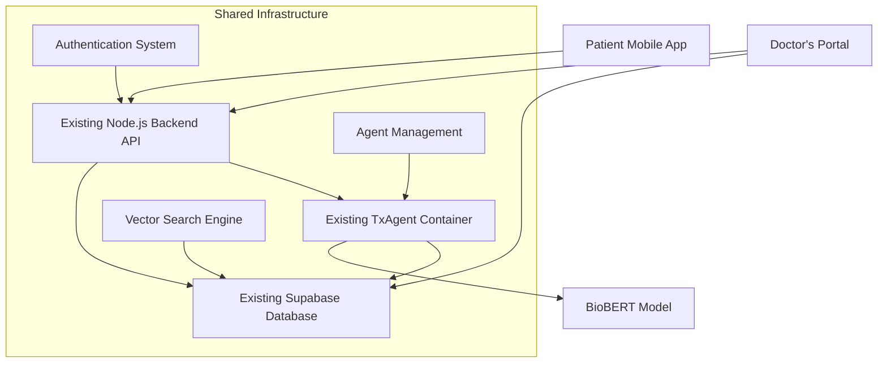

# Customer App Development Guide - Symptom Savior Patient Portal

<div align="center">
  
  
  **Building the Patient Mobile Application**
  
  *Technical Guide for Frontend Development Team*
</div>

---

## 🎯 **Overview**

This document provides comprehensive guidance for building the **Symptom Savior Patient Mobile Application** that interfaces with the existing TxAgent infrastructure and Supabase database. The patient app will enable users to track symptoms, chat with AI agents, and maintain their personal health records.

**Key Differences from Doctor's Portal:**

- **Patient-focused UI/UX** with symptom tracking capabilities
- **Personal health data management** instead of medical document processing
- **Symptom embedding storage** for personalized health insights
- **Mobile-first design** optimized for smartphones and tablets
- **Privacy-first architecture** with user-scoped data isolation

---

## 🏗️ **Architecture Integration**

### **Existing Infrastructure You'll Leverage (85% Reusable)**



### **What's Already Production-Ready (Leverage Immediately)**

#### **✅ Authentication System (100% Reusable)**

```typescript
// Exact same Supabase Auth flow as Doctor's Portal
const { user, session } = useAuth();

// Same JWT token handling with axios interceptors
api.interceptors.request.use((config) => {
  const token = getStoredToken();
  if (token) config.headers.Authorization = `Bearer ${token}`;
  return config;
});
```

#### **✅ Chat API Endpoints (95% Reusable)**

```typescript
// Primary TxAgent Chat - Works for both doctors and patients
POST /api/chat
Headers: { Authorization: "Bearer <jwt_token>" }
Body: {
  "message": "I have chest pain and shortness of breath",
  "top_k": 5,
  "temperature": 0.7
}

// OpenAI Fallback - Universal medical advice
POST /api/openai-chat
Headers: { Authorization: "Bearer <jwt_token>" }
Body: {
  "message": "What should I do about recurring headaches?",
  "context": []
}
```

#### **✅ Agent Management (90% Reusable)**

```typescript
// Same agent lifecycle endpoints
GET / api / agent / status; // Check if TxAgent is active
POST / api / agent / start; // Start personal TxAgent session
POST / api / agent / stop; // Stop session
POST / api / agent / test - health; // Verify agent connectivity
```

#### **✅ Vector Search Infrastructure (100% Reusable)**

```sql
-- Same pgvector setup with BioBERT 768-dimensional embeddings
-- Same similarity search functions
-- Same performance optimization patterns
```

### **What You Need to Build (15% New Code)**

- 📱 **Mobile Frontend**: React Native app with patient-focused UI
- 🏥 **Symptom Tracking Components**: Input forms and history views
- 📊 **Health Analytics**: Personal health insights and trend analysis
- 🔒 **Patient-Specific RLS**: Modified database policies for personal data

---

## 🗄️ **Database Schema Extensions**

### **New Table: `symptoms` (Patient-Specific Data)**

```sql
CREATE TABLE public.symptoms (
  id UUID PRIMARY KEY DEFAULT gen_random_uuid(),
  user_id UUID NOT NULL REFERENCES auth.users(id) ON DELETE CASCADE,
  symptom_text TEXT NOT NULL,                    -- Patient's symptom description
  embedding VECTOR(768),                         -- BioBERT embedding (same as documents)
  severity INTEGER CHECK (severity >= 1 AND severity <= 10), -- 1-10 pain scale
  duration_hours INTEGER,                        -- How long symptom has lasted
  metadata JSONB DEFAULT '{}'::JSONB,            -- Additional symptom details
  created_at TIMESTAMPTZ DEFAULT now(),
  updated_at TIMESTAMPTZ DEFAULT now()
);

-- Performance indexes (same pattern as documents table)
CREATE INDEX symptoms_user_id_idx ON public.symptoms USING btree (user_id);
CREATE INDEX symptoms_created_at_idx ON public.symptoms USING btree (created_at);
CREATE INDEX symptoms_embedding_idx ON public.symptoms
  USING ivfflat (embedding vector_cosine_ops) WITH (lists='100');
CREATE INDEX symptoms_severity_idx ON public.symptoms USING btree (severity);
```

### **New Table: `patient_profiles` (Health History)**

```sql
CREATE TABLE public.patient_profiles (
  id UUID PRIMARY KEY DEFAULT gen_random_uuid(),
  user_id UUID NOT NULL REFERENCES auth.users(id) ON DELETE CASCADE,
  date_of_birth DATE,
  medical_history JSONB DEFAULT '{}'::JSONB,     -- Past conditions, surgeries
  current_medications JSONB DEFAULT '[]'::JSONB, -- Current medication list
  allergies JSONB DEFAULT '[]'::JSONB,           -- Known allergies
  emergency_contacts JSONB DEFAULT '[]'::JSONB,  -- Emergency contact info
  privacy_settings JSONB DEFAULT '{}'::JSONB,    -- Data sharing preferences
  created_at TIMESTAMPTZ DEFAULT now(),
  updated_at TIMESTAMPTZ DEFAULT now()
);

CREATE INDEX patient_profiles_user_id_idx ON public.patient_profiles USING btree (user_id);
```

### **Modified RLS Policies (Key Difference from Doctor's Portal)**

```sql
-- CRITICAL DIFFERENCE: Patients see only their own data (vs shared medical docs for doctors)

-- Enable RLS on new tables
ALTER TABLE public.symptoms ENABLE ROW LEVEL SECURITY;
ALTER TABLE public.patient_profiles ENABLE ROW LEVEL SECURITY;

-- Patients can only access their own symptoms
CREATE POLICY "Users can only access their own symptoms"
  ON public.symptoms FOR ALL TO authenticated
  USING (auth.uid() = user_id)
  WITH CHECK (auth.uid() = user_id);

-- Patients can only access their own profile
CREATE POLICY "Users can only access their own profile"
  ON public.patient_profiles FOR ALL TO authenticated
  USING (auth.uid() = user_id)
  WITH CHECK (auth.uid() = user_id);

-- Keep existing documents policy - patients can still read medical literature for chat context
-- (No changes to documents table RLS - patients benefit from shared medical knowledge)
```

### **Patient Symptom Search Function (Reuses Vector Search Pattern)**

```sql
CREATE OR REPLACE FUNCTION public.match_user_symptoms(
  user_uuid UUID,
  query_embedding VECTOR(768),
  match_threshold FLOAT DEFAULT 0.7,
  match_count INTEGER DEFAULT 10
)
RETURNS TABLE (
  id UUID,
  symptom_text TEXT,
  severity INTEGER,
  duration_hours INTEGER,
  metadata JSONB,
  created_at TIMESTAMPTZ,
  similarity FLOAT
)
LANGUAGE plpgsql STABLE SECURITY DEFINER
SET search_path = public, pg_catalog
AS $$
BEGIN
    RETURN QUERY
    SELECT
        symptoms.id,
        symptoms.symptom_text,
        symptoms.severity,
        symptoms.duration_hours,
        symptoms.metadata,
        symptoms.created_at,
        1 - (symptoms.embedding <=> query_embedding) AS similarity
    FROM public.symptoms
    WHERE symptoms.user_id = user_uuid
        AND symptoms.embedding IS NOT NULL
        AND 1 - (symptoms.embedding <=> query_embedding) > match_threshold
    ORDER BY symptoms.embedding <=> query_embedding
    LIMIT match_count;
END;
$$;
```

---

## 🔌 **API Integration Guide**

### **Existing Endpoints (Use As-Is)**

#### **Authentication (100% Reusable)**

```typescript
// Same Supabase Auth endpoints from Doctor's Portal
import { createClient } from "@supabase/supabase-js";

const supabase = createClient(
  "https://your-project.supabase.co", // Same Supabase project
  "your-anon-key" // Same anon key
);

// Same authentication flow
const { data, error } = await supabase.auth.signInWithPassword({
  email: "patient@example.com",
  password: "password123",
});
```

#### **Chat Endpoints (95% Reusable)**

```typescript
// TxAgent Chat - Same endpoint, patient-focused prompts
POST /api/chat
Headers: { Authorization: "Bearer <jwt_token>" }
Body: {
  "message": "I've been having recurring headaches for 3 days. What could cause this?",
  "top_k": 5,                    // Same parameters
  "temperature": 0.7             // Same AI settings
}

// Response format is identical
{
  "response": "Recurring headaches can be caused by...",
  "sources": [                   // Same medical literature sources
    {
      "filename": "neurology-guidelines.pdf",
      "content": "Relevant medical text...",
      "similarity": 0.89
    }
  ],
  "agent_id": "txagent",
  "processing_time": 1250,
  "model": "BioBERT"
}

// OpenAI Fallback - Same endpoint
POST /api/openai-chat
Headers: { Authorization: "Bearer <jwt_token>" }
Body: {
  "message": "Is it normal to have chest pain after exercise?",
  "context": []                  // Previous conversation history
}
```

#### **Agent Management (90% Reusable)**

```typescript
// Same agent lifecycle management
GET / api / agent / status;
POST / api / agent / start;
POST / api / agent / stop;
POST / api / agent / test - health;

// Same response formats and error handling
// Same authentication requirements
// Same session management logic
```

### **New Endpoints You Need (Request from Backend Team)**

#### **Symptom Management**

```typescript
// Add new symptom with embedding generation
POST /api/symptoms
Headers: { Authorization: "Bearer <jwt_token>" }
Body: {
  "symptom_text": "Severe headache with nausea and light sensitivity",
  "severity": 8,
  "duration_hours": 6,
  "metadata": {
    "triggers": ["stress", "lack_of_sleep"],
    "location": "frontal",
    "type": "throbbing",
    "associated_symptoms": ["nausea", "photophobia"]
  }
}

Response: {
  "id": "uuid",
  "symptom_text": "Severe headache with nausea...",
  "embedding": [768 float values],  // Generated by TxAgent BioBERT
  "severity": 8,
  "created_at": "2024-01-01T00:00:00Z"
}

// Get user's symptom history with pagination
GET /api/symptoms?limit=50&offset=0&sort=created_at&order=desc
Headers: { Authorization: "Bearer <jwt_token>" }

Response: {
  "symptoms": [...],
  "total": 150,
  "page": 1,
  "pages": 3
}

// Find similar symptoms using vector search
POST /api/symptoms/search
Headers: { Authorization: "Bearer <jwt_token>" }
Body: {
  "query": "headache nausea light sensitivity",
  "limit": 10,
  "threshold": 0.7
}

Response: {
  "similar_symptoms": [
    {
      "id": "uuid",
      "symptom_text": "Migraine with aura...",
      "similarity": 0.89,
      "created_at": "2024-01-01T00:00:00Z"
    }
  ]
}

// Update symptom (e.g., severity changed, duration extended)
PUT /api/symptoms/:id
Headers: { Authorization: "Bearer <jwt_token>" }
Body: {
  "severity": 6,                 // Improved from 8 to 6
  "duration_hours": 8,           // Extended duration
  "metadata": {
    "status": "improving",
    "treatments_tried": ["ibuprofen", "rest"]
  }
}

// Delete symptom
DELETE /api/symptoms/:id
Headers: { Authorization: "Bearer <jwt_token>" }
```

#### **Patient Profile Management**

```typescript
// Get patient profile
GET /api/profile
Headers: { Authorization: "Bearer <jwt_token>" }

Response: {
  "id": "uuid",
  "date_of_birth": "1990-01-01",
  "medical_history": {
    "conditions": ["hypertension", "diabetes_type_2"],
    "surgeries": ["appendectomy_2015"],
    "family_history": ["heart_disease", "diabetes"]
  },
  "current_medications": [
    {"name": "metformin", "dosage": "500mg", "frequency": "twice_daily"},
    {"name": "lisinopril", "dosage": "10mg", "frequency": "once_daily"}
  ],
  "allergies": ["penicillin", "shellfish"],
  "emergency_contacts": [
    {"name": "John Doe", "relationship": "spouse", "phone": "+1234567890"}
  ]
}

// Update patient profile
PUT /api/profile
Headers: { Authorization: "Bearer <jwt_token>" }
Body: {
  "medical_history": {
    "conditions": ["hypertension", "diabetes_type_2", "migraine"],  // Added migraine
    "recent_visits": ["cardiologist_2024_01_15"]
  },
  "current_medications": [
    // Updated medication list
  ]
}
```

#### **Health Analytics**

```typescript
// Get symptom trends over time
GET /api/health/trends?period=30days&symptom_type=headache
Headers: { Authorization: "Bearer <jwt_token>" }

Response: {
  "period": "30days",
  "symptom_counts": [
    {"date": "2024-01-01", "count": 2, "avg_severity": 6.5},
    {"date": "2024-01-02", "count": 0, "avg_severity": null},
    {"date": "2024-01-03", "count": 1, "avg_severity": 7.0}
  ],
  "trends": {
    "frequency_trend": "increasing",
    "severity_trend": "stable",
    "duration_trend": "decreasing"
  }
}

// Get symptom patterns and correlations
GET /api/health/patterns
Headers: { Authorization: "Bearer <jwt_token>" }

Response: {
  "common_patterns": [
    {
      "pattern": "headache_with_nausea",
      "frequency": 15,
      "avg_severity": 7.2,
      "common_triggers": ["stress", "lack_of_sleep"]
    }
  ],
  "correlations": [
    {
      "symptom_a": "headache",
      "symptom_b": "fatigue",
      "correlation": 0.78,
      "significance": "high"
    }
  ]
}

// Export health data (PDF report)
GET /api/health/export?format=pdf&period=90days
Headers: { Authorization: "Bearer <jwt_token>" }

Response: Binary PDF file with health summary
```

---

## 📱 **Frontend Implementation Guide**

### **Recommended Tech Stack (Based on Doctor's Portal Success)**

#### **React Native (Recommended - Mirrors Doctor's Portal Tech)**

```bash
# Setup new React Native project
npx react-native init SymptomSaviorPatient
cd SymptomSaviorPatient

# Install dependencies (same as Doctor's Portal where applicable)
npm install @supabase/supabase-js axios
npm install @react-navigation/native @react-navigation/stack
npm install react-native-vector-icons react-native-svg
npm install react-native-chart-kit react-native-calendars
npm install react-native-date-picker react-native-modal
npm install react-hook-form react-query
```

### **Reusable Code Patterns from Doctor's Portal**

#### **1. Authentication Service (100% Reusable)**

```typescript
// lib/auth.ts - Copy directly from Doctor's Portal
import { createClient } from "@supabase/supabase-js";

const supabase = createClient(
  process.env.REACT_APP_SUPABASE_URL!,
  process.env.REACT_APP_SUPABASE_ANON_KEY!
);

export class AuthService {
  // Same methods as Doctor's Portal
  async signIn(email: string, password: string) {
    const { data, error } = await supabase.auth.signInWithPassword({
      email,
      password,
    });
    return { user: data.user, session: data.session, error };
  }

  async signUp(email: string, password: string, metadata: any) {
    const { data, error } = await supabase.auth.signUp({
      email,
      password,
      options: {
        data: {
          ...metadata,
          user_type: "patient", // Key difference
        },
      },
    });
    return { user: data.user, error };
  }

  // ... same getSession, signOut methods
}
```

#### **2. API Client (95% Reusable)**

```typescript
// lib/api.ts - Reuse axios setup from Doctor's Portal
import axios from "axios";

const API_BASE_URL = process.env.REACT_APP_API_URL || "";

export const api = axios.create({
  baseURL: API_BASE_URL,
  timeout: 30000,
  headers: {
    "Content-Type": "application/json",
  },
});

// Same JWT interceptor from Doctor's Portal
api.interceptors.request.use((config) => {
  const token = getStoredToken();
  if (token) {
    config.headers.Authorization = `Bearer ${token}`;
  }
  return config;
});

// Reusable API helpers with patient-specific endpoints
export const apiHelpers = {
  // Same chat methods from Doctor's Portal
  chat: (message: string, context: any[] = []) =>
    api.post("/api/chat", { message, context }),

  openaiChat: (message: string, context: any[] = []) =>
    api.post("/api/openai-chat", { message, context }),

  // Same agent methods
  agent: {
    getStatus: () => api.get("/api/agent/status"),
    start: () => api.post("/api/agent/start"),
    stop: () => api.post("/api/agent/stop"),
    healthCheck: () => api.post("/api/agent/test-health"),
  },

  // New patient-specific methods
  symptoms: {
    create: (symptom: SymptomData) => api.post("/api/symptoms", symptom),
    list: (params?: any) => api.get("/api/symptoms", { params }),
    search: (query: string) => api.post("/api/symptoms/search", { query }),
    update: (id: string, data: Partial<SymptomData>) =>
      api.put(`/api/symptoms/${id}`, data),
    delete: (id: string) => api.delete(`/api/symptoms/${id}`),
  },

  profile: {
    get: () => api.get("/api/profile"),
    update: (data: any) => api.put("/api/profile", data),
  },

  health: {
    trends: (params?: any) => api.get("/api/health/trends", { params }),
    patterns: () => api.get("/api/health/patterns"),
    export: (format: string) => api.get(`/api/health/export?format=${format}`),
  },
};
```

#### **3. Chat Interface (90% Reusable)**

```typescript
// components/Chat/PatientChat.tsx - Based on Doctor's Portal chat
import { useChat } from "../../hooks/useChat"; // Reuse hook from Doctor's Portal

interface Message {
  id: string;
  type: "user" | "assistant" | "system";
  content: string;
  timestamp: Date;
  sources?: any[];
}

export const PatientChat: React.FC = () => {
  // Reuse chat hook from Doctor's Portal with minor modifications
  const { messages, sendMessage, isLoading } = useChat();
  const [inputText, setInputText] = useState("");

  const handleSendMessage = async () => {
    if (!inputText.trim() || isLoading) return;

    // Same message sending logic as Doctor's Portal
    await sendMessage(inputText);
    setInputText("");
  };

  return (
    <View style={styles.container}>
      {/* Same message list component */}
      <FlatList
        data={messages}
        renderItem={({ item }) => (
          <MessageBubble
            message={item}
            isPatient={true} // UI variant for patient interface
          />
        )}
        keyExtractor={(item) => item.id}
      />

      {/* Patient-specific input placeholder */}
      <View style={styles.inputContainer}>
        <TextInput
          style={styles.textInput}
          value={inputText}
          onChangeText={setInputText}
          placeholder="Describe your symptoms or ask a health question..."
          multiline
          maxLength={500}
        />
        <TouchableOpacity
          style={[styles.sendButton, isLoading && styles.disabled]}
          onPress={handleSendMessage}
          disabled={isLoading || !inputText.trim()}
        >
          <Text style={styles.sendButtonText}>
            {isLoading ? "Sending..." : "Send"}
          </Text>
        </TouchableOpacity>
      </View>
    </View>
  );
};
```

#### **4. Agent Management (85% Reusable)**

```typescript
// hooks/useAgentConnection.ts - Reuse from Doctor's Portal
import { useAgents } from "./useAgents"; // Copy from Doctor's Portal

export const PatientAgentManager: React.FC = () => {
  // Same agent management logic from Doctor's Portal
  const {
    agentStatus,
    startAgent,
    stopAgent,
    performDetailedStatusCheck,
    actionLoading,
  } = useAgents(); // Reuse entire hook

  return (
    <View style={styles.container}>
      <Text style={styles.title}>Your AI Health Assistant</Text>

      {/* Same status display with patient-friendly text */}
      <StatusCard
        status={agentStatus}
        title="TxAgent Health Assistant"
        description="Your personal medical AI assistant powered by BioBERT"
      />

      {/* Same action buttons with patient-focused labels */}
      <View style={styles.actions}>
        {!agentStatus?.agent_active ? (
          <Button
            title="Start Health Assistant"
            onPress={startAgent}
            loading={actionLoading}
            style={styles.startButton}
          />
        ) : (
          <Button
            title="Stop Health Assistant"
            onPress={stopAgent}
            loading={actionLoading}
            style={styles.stopButton}
          />
        )}
      </View>
    </View>
  );
};
```

### **New Patient-Specific Components**

#### **5. Symptom Input Form**

```typescript
// components/Symptoms/SymptomInput.tsx
interface SymptomData {
  symptom_text: string;
  severity: number;
  duration_hours: number;
  metadata: {
    triggers?: string[];
    location?: string;
    type?: string;
    associated_symptoms?: string[];
  };
}

export const SymptomInput: React.FC = () => {
  const [formData, setFormData] = useState<SymptomData>({
    symptom_text: '',
    severity: 5,
    duration_hours: 1,
    metadata: {}
  });

  const [isSubmitting, setIsSubmitting] = useState(false);

  const handleSubmit = async () => {
    if (!formData.symptom_text.trim()) {
      Alert.alert('Error', 'Please describe your symptom');
      return;
    }

    setIsSubmitting(true);
    try {
      // Use reusable API helper
      await apiHelpers.symptoms.create(formData);

      Alert.alert('Success', 'Symptom logged successfully');

      // Reset form
      setFormData({
        symptom_text: '',
        severity: 5,
        duration_hours: 1,
        metadata: {}
      });

      // Navigate to symptom history or dashboard
    } catch (error: any) {
      Alert.alert('Error', error.response?.data?.error || 'Failed to log symptom');
    } finally {
      setIsSubmitting(false);
    }
  };

  return (
    <ScrollView style={styles.container}>
      <Text style={styles.title}>Log Your Symptom</Text>

      {/* Symptom description */}
      <View style={styles.section}>
        <Text style={styles.label}>Describe your symptom:</Text>
        <TextInput
          style={styles.textArea}
          value={formData.symptom_text}
          onChangeText={(text) => setFormData(prev => ({ ...prev, symptom_text: text }))}
          placeholder="e.g., Severe headache with nausea and light sensitivity"
          multiline
          numberOfLines={4}
          maxLength={500}
        />
      </View>

      {/* Severity slider */}
      <View style={styles.section}>
        <Text style={styles.label}>Pain/Severity Level (1-10):</Text>
        <View style={styles.sliderContainer}>
          <Text style={styles.sliderLabel}>1 (Mild)</Text>
          <Slider
            style={styles.slider}
            value={formData.severity}
            onValueChange={(value) => setFormData(prev => ({ ...prev, severity: Math.round(value) }))}
            minimumValue={1}
            maximumValue={10}
            step={1}
            thumbStyle={styles.sliderThumb}
            trackStyle={styles.sliderTrack}
          />
          <Text style={styles.sliderLabel}>10 (Severe)</Text>
        </View>
        <Text style={styles.severityValue}>Current: {formData.severity}</Text>
      </View>

      {/* Duration */}
      <View style={styles.section}>
        <Text style={styles.label}>How long have you had this symptom?</Text>
        <TextInput
          style={styles.numberInput}
          value={formData.duration_hours.toString()}
          onChangeText={(text) => {
            const hours = parseInt(text) || 1;
            setFormData(prev => ({ ...prev, duration_hours: hours }));
          }}
          keyboardType="numeric"
          placeholder="Hours"
        />
        <Text style={styles.hint}>Enter duration in hours</Text>
      </View>

      {/* Optional metadata */}
      <View style={styles.section}>
        <Text style={styles.label}>Additional Details (Optional):</Text>

        {/* Location picker */}
        <Text style={styles.subLabel}>Location:</Text>
        <TextInput
          style={styles.input}
          value={formData.metadata.location || ''}
          onChangeText={(text) => setFormData(prev => ({
            ...prev,
            metadata: { ...prev.metadata, location: text }
          ))}
          placeholder="e.g., forehead, chest, abdomen"
        />

        {/* Type picker */}
        <Text style={styles.subLabel}>Type:</Text>
        <TextInput
          style={styles.input}
          value={formData.metadata.type || ''}
          onChangeText={(text) => setFormData(prev => ({
            ...prev,
            metadata: { ...prev.metadata, type: text }
          ))}
          placeholder="e.g., throbbing, sharp, dull, burning"
        />
      </View>

      {/* Submit button */}
      <TouchableOpacity
        style={[styles.submitButton, isSubmitting && styles.disabled]}
        onPress={handleSubmit}
        disabled={isSubmitting}
      >
        <Text style={styles.submitButtonText}>
          {isSubmitting ? 'Logging Symptom...' : 'Log Symptom'}
        </Text>
      </TouchableOpacity>
    </ScrollView>
  );
};
```

#### **6. Symptom History & Analytics**

```typescript
// components/Symptoms/SymptomHistory.tsx
export const SymptomHistory: React.FC = () => {
  const [symptoms, setSymptoms] = useState<Symptom[]>([]);
  const [loading, setLoading] = useState(true);
  const [refreshing, setRefreshing] = useState(false);

  const loadSymptoms = async () => {
    try {
      setLoading(true);
      const response = await apiHelpers.symptoms.list({
        limit: 50,
        sort: "created_at",
        order: "desc",
      });
      setSymptoms(response.data.symptoms);
    } catch (error: any) {
      Alert.alert("Error", "Failed to load symptom history");
    } finally {
      setLoading(false);
    }
  };

  const onRefresh = async () => {
    setRefreshing(true);
    await loadSymptoms();
    setRefreshing(false);
  };

  useEffect(() => {
    loadSymptoms();
  }, []);

  const renderSymptomCard = ({ item }: { item: Symptom }) => (
    <TouchableOpacity
      style={styles.symptomCard}
      onPress={() => navigateToSymptomDetail(item)}
    >
      <View style={styles.cardHeader}>
        <Text style={styles.symptomText} numberOfLines={2}>
          {item.symptom_text}
        </Text>
        <View style={[styles.severityBadge, getSeverityColor(item.severity)]}>
          <Text style={styles.severityText}>{item.severity}/10</Text>
        </View>
      </View>

      <View style={styles.cardDetails}>
        <Text style={styles.duration}>
          Duration: {formatDuration(item.duration_hours)}
        </Text>
        <Text style={styles.date}>{formatDate(item.created_at)}</Text>
      </View>

      {item.metadata?.location && (
        <Text style={styles.metadata}>Location: {item.metadata.location}</Text>
      )}
    </TouchableOpacity>
  );

  if (loading) {
    return (
      <View style={styles.centerContainer}>
        <ActivityIndicator size="large" color="#20B2AA" />
        <Text style={styles.loadingText}>Loading your symptom history...</Text>
      </View>
    );
  }

  return (
    <View style={styles.container}>
      <View style={styles.header}>
        <Text style={styles.title}>Your Symptom History</Text>
        <TouchableOpacity
          style={styles.addButton}
          onPress={() => navigation.navigate("SymptomInput")}
        >
          <Icon name="plus" size={24} color="#20B2AA" />
        </TouchableOpacity>
      </View>

      {symptoms.length === 0 ? (
        <View style={styles.emptyState}>
          <Icon name="clipboard-list" size={64} color="#95A5A6" />
          <Text style={styles.emptyTitle}>No symptoms logged yet</Text>
          <Text style={styles.emptyDescription}>
            Start tracking your symptoms to get personalized health insights
          </Text>
          <TouchableOpacity
            style={styles.emptyButton}
            onPress={() => navigation.navigate("SymptomInput")}
          >
            <Text style={styles.emptyButtonText}>Log Your First Symptom</Text>
          </TouchableOpacity>
        </View>
      ) : (
        <FlatList
          data={symptoms}
          renderItem={renderSymptomCard}
          keyExtractor={(item) => item.id}
          refreshControl={
            <RefreshControl refreshing={refreshing} onRefresh={onRefresh} />
          }
          showsVerticalScrollIndicator={false}
        />
      )}
    </View>
  );
};
```

---

## 🔒 **Security Implementation (Reuse Doctor's Portal Patterns)**

### **JWT Token Management (100% Reusable)**

```typescript
// utils/auth-storage.ts - Copy from Doctor's Portal
import AsyncStorage from "@react-native-async-storage/async-storage";

const TOKEN_KEY = "sb-auth-token";
const USER_KEY = "sb-user-data";

export const AuthStorage = {
  async setSession(session: any) {
    try {
      await AsyncStorage.setItem(TOKEN_KEY, JSON.stringify(session));
      if (session.user) {
        await AsyncStorage.setItem(USER_KEY, JSON.stringify(session.user));
      }
    } catch (error) {
      console.error("Failed to store session:", error);
    }
  },

  async getSession() {
    try {
      const sessionData = await AsyncStorage.getItem(TOKEN_KEY);
      return sessionData ? JSON.parse(sessionData) : null;
    } catch (error) {
      console.error("Failed to retrieve session:", error);
      return null;
    }
  },

  async clearSession() {
    try {
      await AsyncStorage.multiRemove([TOKEN_KEY, USER_KEY]);
    } catch (error) {
      console.error("Failed to clear session:", error);
    }
  },
};
```

### **Input Validation (Enhanced for Health Data)**

```typescript
// utils/validation.ts
export const ValidationRules = {
  symptom: {
    text: {
      required: true,
      minLength: 3,
      maxLength: 500,
      pattern: /^[a-zA-Z0-9\s\.,!?'-]+$/, // Allow medical terminology
    },
    severity: {
      required: true,
      min: 1,
      max: 10,
      type: "integer",
    },
    duration: {
      required: true,
      min: 0,
      max: 8760, // Max 1 year in hours
      type: "integer",
    },
  },

  profile: {
    dateOfBirth: {
      required: false,
      maxAge: 120,
      minAge: 0,
    },
    medication: {
      name: { required: true, minLength: 2 },
      dosage: { required: true, pattern: /^\d+(\.\d+)?\s*(mg|ml|g|mcg)$/i },
    },
  },
};

export const validateSymptomInput = (
  symptom: SymptomData
): ValidationError[] => {
  const errors: ValidationError[] = [];

  // Text validation
  if (!symptom.symptom_text || symptom.symptom_text.trim().length < 3) {
    errors.push({
      field: "symptom_text",
      message: "Symptom description must be at least 3 characters",
    });
  }

  if (symptom.symptom_text && symptom.symptom_text.length > 500) {
    errors.push({
      field: "symptom_text",
      message: "Symptom description too long (max 500 characters)",
    });
  }

  // Severity validation
  if (symptom.severity < 1 || symptom.severity > 10) {
    errors.push({
      field: "severity",
      message: "Severity must be between 1 and 10",
    });
  }

  // Duration validation
  if (symptom.duration_hours < 0) {
    errors.push({
      field: "duration_hours",
      message: "Duration cannot be negative",
    });
  }

  if (symptom.duration_hours > 8760) {
    errors.push({
      field: "duration_hours",
      message: "Duration cannot exceed 1 year",
    });
  }

  return errors;
};
```

### **Privacy Controls (Patient-Specific)**

```typescript
// components/Profile/PrivacySettings.tsx
export const PrivacySettings: React.FC = () => {
  const [settings, setSettings] = useState({
    shareSymptomPatterns: false, // Share anonymized patterns for research
    allowHealthInsights: true, // Enable AI health insights
    dataRetentionDays: 365, // How long to keep symptom data
    exportEnabled: true, // Allow data export
    emergencyContactAccess: false, // Allow emergency contacts to view data
  });

  const updatePrivacySetting = async (key: string, value: any) => {
    try {
      const updatedSettings = { ...settings, [key]: value };
      setSettings(updatedSettings);

      // Update in backend
      await apiHelpers.profile.update({
        privacy_settings: updatedSettings,
      });

      Alert.alert("Success", "Privacy settings updated");
    } catch (error) {
      Alert.alert("Error", "Failed to update privacy settings");
    }
  };

  return (
    <ScrollView style={styles.container}>
      <Text style={styles.title}>Privacy & Data Control</Text>

      <View style={styles.section}>
        <Text style={styles.sectionTitle}>Data Sharing</Text>

        <SettingToggle
          title="Share Anonymous Patterns"
          description="Help improve medical research by sharing anonymized symptom patterns"
          value={settings.shareSymptomPatterns}
          onValueChange={(value) =>
            updatePrivacySetting("shareSymptomPatterns", value)
          }
        />

        <SettingToggle
          title="AI Health Insights"
          description="Allow AI to analyze your symptoms and provide health insights"
          value={settings.allowHealthInsights}
          onValueChange={(value) =>
            updatePrivacySetting("allowHealthInsights", value)
          }
        />
      </View>

      <View style={styles.section}>
        <Text style={styles.sectionTitle}>Data Retention</Text>

        <SettingPicker
          title="Keep Symptom Data For"
          value={settings.dataRetentionDays}
          options={[
            { label: "30 days", value: 30 },
            { label: "90 days", value: 90 },
            { label: "1 year", value: 365 },
            { label: "2 years", value: 730 },
            { label: "Forever", value: -1 },
          ]}
          onValueChange={(value) =>
            updatePrivacySetting("dataRetentionDays", value)
          }
        />
      </View>
    </ScrollView>
  );
};
```

---

## 📊 **UI/UX Design Guidelines**

### **Color Scheme (Match Doctor's Portal Brand)**

```typescript
// styles/colors.ts - Reuse from Doctor's Portal
export const Colors = {
  // Primary brand colors
  skyBlue: "#E6F3FF",
  cloudIvory: "#FEFEFE",
  healingTeal: "#20B2AA",
  guardianGold: "#FFD700",
  deepMidnight: "#2C3E50",
  softGray: "#95A5A6",

  // Patient-specific variants
  patientPrimary: "#20B2AA", // Same healing teal
  patientSecondary: "#E6F3FF", // Same sky blue
  patientAccent: "#FFD700", // Same guardian gold

  // Severity level colors
  severity: {
    low: "#2ECC71", // Green (1-3)
    medium: "#F39C12", // Orange (4-6)
    high: "#E74C3C", // Red (7-8)
    severe: "#8E44AD", // Purple (9-10)
  },

  // Status colors
  success: "#2ECC71",
  warning: "#F39C12",
  error: "#E74C3C",
  info: "#3498DB",
};
```

### **Typography (Consistent with Doctor's Portal)**

```typescript
// styles/typography.ts
export const Typography = {
  // Same font families as Doctor's Portal
  heading: {
    fontFamily: "System",
    fontWeight: "700" as const,
  },
  subheading: {
    fontFamily: "System",
    fontWeight: "600" as const,
  },
  body: {
    fontFamily: "System",
    fontWeight: "400" as const,
  },

  // Patient-specific sizes (mobile-optimized)
  sizes: {
    h1: 28,
    h2: 24,
    h3: 20,
    h4: 18,
    body: 16,
    caption: 14,
    small: 12,
  },
};
```

### **Component Library (Extend Doctor's Portal)**

```typescript
// components/ui/PatientCard.tsx
interface PatientCardProps {
  title: string;
  subtitle?: string;
  value?: string | number;
  severity?: number;
  onPress?: () => void;
  style?: any;
}

export const PatientCard: React.FC<PatientCardProps> = ({
  title,
  subtitle,
  value,
  severity,
  onPress,
  style,
}) => {
  const getSeverityColor = (level?: number) => {
    if (!level) return Colors.softGray;
    if (level <= 3) return Colors.severity.low;
    if (level <= 6) return Colors.severity.medium;
    if (level <= 8) return Colors.severity.high;
    return Colors.severity.severe;
  };

  return (
    <TouchableOpacity
      style={[styles.card, style]}
      onPress={onPress}
      activeOpacity={0.7}
    >
      <View style={styles.cardHeader}>
        <Text style={styles.cardTitle}>{title}</Text>
        {severity && (
          <View
            style={[
              styles.severityBadge,
              { backgroundColor: getSeverityColor(severity) },
            ]}
          >
            <Text style={styles.severityText}>{severity}</Text>
          </View>
        )}
      </View>

      {subtitle && <Text style={styles.cardSubtitle}>{subtitle}</Text>}

      {value && <Text style={styles.cardValue}>{value}</Text>}
    </TouchableOpacity>
  );
};
```

---

## 🧪 **Testing Strategy (Build on Doctor's Portal Success)**

### **Unit Testing (Reuse Patterns)**

```typescript
// __tests__/utils/validation.test.ts
import { validateSymptomInput } from "../../utils/validation";

describe("Symptom Validation", () => {
  test("should validate correct symptom input", () => {
    const validSymptom = {
      symptom_text: "Headache with nausea",
      severity: 7,
      duration_hours: 4,
      metadata: {},
    };

    const errors = validateSymptomInput(validSymptom);
    expect(errors).toHaveLength(0);
  });

  test("should reject empty symptom text", () => {
    const invalidSymptom = {
      symptom_text: "",
      severity: 5,
      duration_hours: 2,
      metadata: {},
    };

    const errors = validateSymptomInput(invalidSymptom);
    expect(errors).toContainEqual({
      field: "symptom_text",
      message: expect.stringContaining("at least 3 characters"),
    });
  });

  test("should reject invalid severity range", () => {
    const invalidSymptom = {
      symptom_text: "Valid symptom",
      severity: 15,
      duration_hours: 2,
      metadata: {},
    };

    const errors = validateSymptomInput(invalidSymptom);
    expect(errors).toContainEqual({
      field: "severity",
      message: "Severity must be between 1 and 10",
    });
  });
});
```

### **Integration Testing (Focus on New Endpoints)**

```typescript
// __tests__/api/symptoms.integration.test.ts
import { apiHelpers } from "../../lib/api";
import { AuthService } from "../../lib/auth";

describe("Symptom API Integration", () => {
  beforeAll(async () => {
    // Use test authentication
    await AuthService.signIn("test-patient@example.com", "testpassword");
  });

  test("should create symptom with embedding", async () => {
    const symptomData = {
      symptom_text: "Test headache with nausea",
      severity: 6,
      duration_hours: 3,
      metadata: { location: "frontal" },
    };

    const response = await apiHelpers.symptoms.create(symptomData);

    expect(response.status).toBe(201);
    expect(response.data).toMatchObject({
      id: expect.any(String),
      symptom_text: symptomData.symptom_text,
      severity: symptomData.severity,
      embedding: expect.arrayContaining([expect.any(Number)]), // 768 dimensions
    });

    // Verify embedding dimensions
    expect(response.data.embedding).toHaveLength(768);
  });

  test("should find similar symptoms", async () => {
    // First create a symptom
    await apiHelpers.symptoms.create({
      symptom_text: "Migraine with aura and nausea",
      severity: 8,
      duration_hours: 6,
    });

    // Then search for similar
    const searchResponse = await apiHelpers.symptoms.search("headache nausea");

    expect(searchResponse.status).toBe(200);
    expect(searchResponse.data.similar_symptoms).toBeInstanceOf(Array);

    if (searchResponse.data.similar_symptoms.length > 0) {
      expect(searchResponse.data.similar_symptoms[0]).toMatchObject({
        id: expect.any(String),
        symptom_text: expect.any(String),
        similarity: expect.any(Number),
      });

      // Similarity should be between 0 and 1
      expect(
        searchResponse.data.similar_symptoms[0].similarity
      ).toBeGreaterThan(0);
      expect(
        searchResponse.data.similar_symptoms[0].similarity
      ).toBeLessThanOrEqual(1);
    }
  });
});
```

### **E2E Testing (Critical User Flows)**

```typescript
// e2e/symptom-tracking.e2e.ts
import { by, device, element, expect } from "detox";

describe("Symptom Tracking Flow", () => {
  beforeAll(async () => {
    await device.launchApp();
  });

  test("complete symptom logging flow", async () => {
    // Login
    await element(by.id("loginButton")).tap();
    await element(by.id("emailInput")).typeText("test-patient@example.com");
    await element(by.id("passwordInput")).typeText("testpassword");
    await element(by.id("signInButton")).tap();

    // Navigate to symptom input
    await element(by.id("logSymptomButton")).tap();

    // Fill symptom form
    await element(by.id("symptomTextInput")).typeText(
      "Severe headache with light sensitivity"
    );
    await element(by.id("severitySlider")).swipe("right", "slow"); // Increase severity
    await element(by.id("durationInput")).typeText("6");

    // Submit symptom
    await element(by.id("submitSymptomButton")).tap();

    // Verify success
    await expect(element(by.text("Symptom logged successfully"))).toBeVisible();

    // Verify symptom appears in history
    await element(by.id("symptomHistoryTab")).tap();
    await expect(
      element(by.text("Severe headache with light sensitivity"))
    ).toBeVisible();
  });

  test("chat about symptoms", async () => {
    // Navigate to chat
    await element(by.id("chatTab")).tap();

    // Start agent if needed
    const agentStatus = await element(by.id("agentStatus"));
    try {
      await expect(agentStatus).toHaveText("Active");
    } catch {
      await element(by.id("startAgentButton")).tap();
      await waitFor(element(by.id("agentStatus")))
        .toHaveText("Active")
        .withTimeout(30000);
    }

    // Send message about symptoms
    await element(by.id("chatInput")).typeText(
      "I have been having recurring headaches. What could cause this?"
    );
    await element(by.id("sendMessageButton")).tap();

    // Wait for AI response
    await waitFor(element(by.id("aiMessage")))
      .toBeVisible()
      .withTimeout(10000);

    // Verify response contains medical advice
    const response = await element(by.id("aiMessage")).getText();
    expect(response).toMatch(/headache|pain|migraine|tension/i);
  });
});
```

---

## 🚀 **Deployment & DevOps (Leverage Existing Infrastructure)**

### **Development Environment Setup**

```bash
# 1. Clone and setup React Native project
git clone https://github.com/your-org/symptom-savior-patient
cd symptom-savior-patient
npm install

# 2. Link to existing backend (same as Doctor's Portal)
# No new backend deployment needed - reuse existing API

# 3. Configure environment variables
cp .env.example .env.local

# Add same Supabase configuration as Doctor's Portal
REACT_APP_SUPABASE_URL=https://your-project.supabase.co
REACT_APP_SUPABASE_ANON_KEY=your_anon_key
REACT_APP_API_URL=https://your-api.onrender.com

# 4. iOS Setup
cd ios
xcodebuild -workspace SymptomSaviorPatient.xcworkspace \
           -scheme SymptomSaviorPatient \
           -configuration Release \
           -archivePath build/SymptomSaviorPatient.xcarchive \
           archive

# 5. Android Setup
# Ensure Android SDK and tools are installed
```

### **Database Migration (Add to Existing Database)**

```sql
-- migration_add_patient_tables.sql
-- Run this against the same Supabase database as Doctor's Portal

BEGIN;

-- Create symptoms table
CREATE TABLE public.symptoms (
  id UUID PRIMARY KEY DEFAULT gen_random_uuid(),
  user_id UUID NOT NULL REFERENCES auth.users(id) ON DELETE CASCADE,
  symptom_text TEXT NOT NULL,
  embedding VECTOR(768),
  severity INTEGER CHECK (severity >= 1 AND severity <= 10),
  duration_hours INTEGER,
  metadata JSONB DEFAULT '{}'::JSONB,
  created_at TIMESTAMPTZ DEFAULT now(),
  updated_at TIMESTAMPTZ DEFAULT now()
);

-- Create patient profiles table
CREATE TABLE public.patient_profiles (
  id UUID PRIMARY KEY DEFAULT gen_random_uuid(),
  user_id UUID NOT NULL REFERENCES auth.users(id) ON DELETE CASCADE,
  date_of_birth DATE,
  medical_history JSONB DEFAULT '{}'::JSONB,
  current_medications JSONB DEFAULT '[]'::JSONB,
  allergies JSONB DEFAULT '[]'::JSONB,
  emergency_contacts JSONB DEFAULT '[]'::JSONB,
  privacy_settings JSONB DEFAULT '{}'::JSONB,
  created_at TIMESTAMPTZ DEFAULT now(),
  updated_at TIMESTAMPTZ DEFAULT now()
);

-- Add indexes
CREATE INDEX symptoms_user_id_idx ON public.symptoms USING btree (user_id);
CREATE INDEX symptoms_created_at_idx ON public.symptoms USING btree (created_at);
CREATE INDEX symptoms_embedding_idx ON public.symptoms
  USING ivfflat (embedding vector_cosine_ops) WITH (lists='100');
CREATE INDEX symptoms_severity_idx ON public.symptoms USING btree (severity);

CREATE INDEX patient_profiles_user_id_idx ON public.patient_profiles USING btree (user_id);

-- Enable RLS
ALTER TABLE public.symptoms ENABLE ROW LEVEL SECURITY;
ALTER TABLE public.patient_profiles ENABLE ROW LEVEL SECURITY;

-- Add RLS policies
CREATE POLICY "Users can only access their own symptoms"
  ON public.symptoms FOR ALL TO authenticated
  USING (auth.uid() = user_id)
  WITH CHECK (auth.uid() = user_id);

CREATE POLICY "Users can only access their own profile"
  ON public.patient_profiles FOR ALL TO authenticated
  USING (auth.uid() = user_id)
  WITH CHECK (auth.uid() = user_id);

-- Add symptom search function
CREATE OR REPLACE FUNCTION public.match_user_symptoms(
  user_uuid UUID,
  query_embedding VECTOR(768),
  match_threshold FLOAT DEFAULT 0.7,
  match_count INTEGER DEFAULT 10
)
RETURNS TABLE (
  id UUID,
  symptom_text TEXT,
  severity INTEGER,
  duration_hours INTEGER,
  metadata JSONB,
  created_at TIMESTAMPTZ,
  similarity FLOAT
)
LANGUAGE plpgsql STABLE SECURITY DEFINER
SET search_path = public, pg_catalog
AS $$
BEGIN
    RETURN QUERY
    SELECT
        symptoms.id,
        symptoms.symptom_text,
        symptoms.severity,
        symptoms.duration_hours,
        symptoms.metadata,
        symptoms.created_at,
        1 - (symptoms.embedding <=> query_embedding) AS similarity
    FROM public.symptoms
    WHERE symptoms.user_id = user_uuid
        AND symptoms.embedding IS NOT NULL
        AND 1 - (symptoms.embedding <=> query_embedding) > match_threshold
    ORDER BY symptoms.embedding <=> query_embedding
    LIMIT match_count;
END;
$$;

COMMIT;
```

### **Backend API Extensions (Request from Backend Team)**

```javascript
// backend/routes/symptoms.js - Add to existing backend
const express = require("express");
const router = express.Router();
const { authenticateJWT } = require("../middleware/auth"); // Reuse existing auth
const { supabase } = require("../lib/supabase"); // Reuse existing Supabase client

// Create symptom with embedding generation
router.post("/symptoms", authenticateJWT, async (req, res) => {
  try {
    const { symptom_text, severity, duration_hours, metadata } = req.body;
    const user_id = req.user.id;

    // Generate embedding using existing TxAgent infrastructure
    const embeddingResponse = await fetch(
      `${process.env.RUNPOD_EMBEDDING_URL}/embed`,
      {
        method: "POST",
        headers: {
          Authorization: `Bearer ${req.headers.authorization.split(" ")[1]}`,
          "Content-Type": "application/json",
        },
        body: JSON.stringify({
          text: symptom_text,
          normalize: true,
        }),
      }
    );

    if (!embeddingResponse.ok) {
      throw new Error("Failed to generate embedding");
    }

    const { embedding } = await embeddingResponse.json();

    // Store in database
    const { data, error } = await supabase
      .from("symptoms")
      .insert({
        user_id,
        symptom_text,
        embedding,
        severity,
        duration_hours,
        metadata,
      })
      .select()
      .single();

    if (error) throw error;

    res.status(201).json(data);
  } catch (error) {
    console.error("Create symptom error:", error);
    res.status(500).json({ error: error.message });
  }
});

// Get user symptoms
router.get("/symptoms", authenticateJWT, async (req, res) => {
  try {
    const user_id = req.user.id;
    const {
      limit = 50,
      offset = 0,
      sort = "created_at",
      order = "desc",
    } = req.query;

    const { data, error } = await supabase
      .from("symptoms")
      .select("*")
      .eq("user_id", user_id)
      .order(sort, { ascending: order === "asc" })
      .range(offset, offset + limit - 1);

    if (error) throw error;

    res.json({ symptoms: data });
  } catch (error) {
    console.error("Get symptoms error:", error);
    res.status(500).json({ error: error.message });
  }
});

// Search similar symptoms
router.post("/symptoms/search", authenticateJWT, async (req, res) => {
  try {
    const { query, limit = 10, threshold = 0.7 } = req.body;
    const user_id = req.user.id;

    // Generate embedding for search query
    const embeddingResponse = await fetch(
      `${process.env.RUNPOD_EMBEDDING_URL}/embed`,
      {
        method: "POST",
        headers: {
          Authorization: `Bearer ${req.headers.authorization.split(" ")[1]}`,
          "Content-Type": "application/json",
        },
        body: JSON.stringify({
          text: query,
          normalize: true,
        }),
      }
    );

    if (!embeddingResponse.ok) {
      throw new Error("Failed to generate search embedding");
    }

    const { embedding } = await embeddingResponse.json();

    // Search using vector similarity
    const { data, error } = await supabase.rpc("match_user_symptoms", {
      user_uuid: user_id,
      query_embedding: embedding,
      match_threshold: threshold,
      match_count: limit,
    });

    if (error) throw error;

    res.json({ similar_symptoms: data });
  } catch (error) {
    console.error("Search symptoms error:", error);
    res.status(500).json({ error: error.message });
  }
});

module.exports = router;
```

### **Mobile App Deployment**

#### **iOS App Store Deployment**

```bash
# 1. Build for release
cd ios
xcodebuild -workspace SymptomSaviorPatient.xcworkspace \
           -scheme SymptomSaviorPatient \
           -configuration Release \
           -archivePath build/SymptomSaviorPatient.xcarchive \
           archive

# 2. Upload to App Store Connect
xcodebuild -exportArchive \
           -archivePath build/SymptomSaviorPatient.xcarchive \
           -exportPath build/ \
           -exportOptionsPlist ExportOptions.plist

# 3. Use Xcode or Application Loader to upload
```

#### **Android Play Store Deployment**

```bash
# 1. Generate signed APK
cd android
./gradlew assembleRelease

# 2. Generate App Bundle (recommended)
./gradlew bundleRelease

# 3. Upload to Google Play Console
# - Use build/outputs/bundle/release/app-release.aab
```

---

## 📋 **Development Timeline & Milestones**

### **Phase 1: Foundation (2 weeks) - 100% Backend Reuse**

- ✅ **Week 1**: Project setup, authentication integration

  - Set up React Native project
  - Integrate Supabase auth (copy from Doctor's Portal)
  - Configure API client with JWT interceptors
  - Test authentication flow

- ✅ **Week 2**: Core navigation and basic UI
  - Implement navigation structure
  - Create base components and styling
  - Set up state management
  - Test basic app functionality

### **Phase 2: Core Features (3 weeks) - 80% Backend Reuse**

- 🔧 **Week 3**: Symptom input and storage

  - Build symptom input form
  - Request backend team to add symptoms API endpoints
  - Test symptom creation and embedding generation
  - Implement input validation

- 🔧 **Week 4**: Chat integration

  - Integrate existing chat API endpoints
  - Build patient-focused chat UI
  - Test TxAgent communication
  - Add agent management controls

- 🔧 **Week 5**: Symptom history and search
  - Build symptom history views
  - Implement symptom search functionality
  - Add symptom editing/deletion
  - Test vector similarity search

### **Phase 3: Advanced Features (2 weeks) - 50% Backend Reuse**

- 🆕 **Week 6**: Health analytics and profiles

  - Request health analytics API endpoints
  - Build patient profile management
  - Implement health trend visualization
  - Add privacy controls

- 🆕 **Week 7**: Polish and optimization
  - Performance optimization
  - UI/UX refinements
  - Accessibility improvements
  - Comprehensive testing

### **Phase 4: Launch Preparation (1 week) - Platform Specific**

- 📱 **Week 8**: Deployment and launch
  - App store submission preparation
  - Final testing and bug fixes
  - Documentation and user guides
  - Soft launch and monitoring

**Total Timeline: 8 weeks (vs 12 weeks for Doctor's Portal from scratch)**

---

## 📞 **Support & Team Coordination**

### **Backend Team Requests (Prioritized)**

#### **High Priority (Week 3)**

1. **Symptoms CRUD endpoints**: POST, GET, PUT, DELETE `/api/symptoms`
2. **Embedding generation**: Integration with existing TxAgent `/embed`
3. **Database migration**: Add symptoms and patient_profiles tables
4. **RLS policies**: Patient-specific data isolation

#### **Medium Priority (Week 6)**

1. **Search functionality**: POST `/api/symptoms/search`
2. **Health analytics**: GET `/api/health/trends`, `/api/health/patterns`
3. **Profile management**: GET/PUT `/api/profile`
4. **Data export**: GET `/api/health/export`

#### **Low Priority (Nice to Have)**

1. **Push notifications**: Symptom reminders and health tips
2. **Data backup/sync**: Cross-device symptom synchronization
3. **Advanced analytics**: ML-powered health insights

### **Design Team Coordination**

- **Brand consistency**: Reuse Doctor's Portal color scheme and typography
- **Patient-focused UI**: Simpler, more accessible interface design
- **Mobile optimization**: Touch-friendly controls and responsive layouts
- **Accessibility**: Screen reader support and high contrast modes

### **QA Team Support**

- **Test planning**: Focus on new patient-specific features
- **Automation**: Extend existing Detox tests for E2E coverage
- **Performance testing**: Ensure app meets speed and responsiveness targets
- **Security testing**: Validate JWT handling and data access controls
