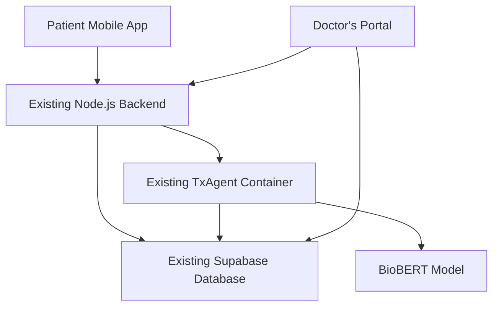

# Customer App Development Guide - Symptom Savior Patient Portal

<div align="center">
  
  
  **Building the Patient Mobile Application**
  
  *Technical Guide for Frontend Development Team*
</div>

---

## 🎯 **Overview**

This document provides comprehensive guidance for building the **Symptom Savior Patient Mobile Application** that interfaces with the existing TxAgent infrastructure and Supabase database. The patient app will enable users to track symptoms, chat with the AI agent, and maintain their personal health records.

**Key Differences from Doctor's Portal:**
- **Patient-focused UI/UX** with symptom tracking capabilities
- **Personal health data management** instead of medical document processing
- **Symptom embedding storage** for personalized health insights
- **Mobile-first design** optimized for smartphones and tablets

---

## 🏗️ **Architecture Integration**

### **Existing Infrastructure You'll Use**



### **What's Already Built (Reusable)**
- ✅ **Authentication System**: JWT-based auth with Supabase
- ✅ **TxAgent Integration**: Chat endpoints and AI processing
- ✅ **Database Infrastructure**: PostgreSQL with vector search
- ✅ **Backend API**: RESTful endpoints with error handling
- ✅ **Security**: Row-level security and data isolation

### **What You Need to Build**
- 📱 **Mobile Frontend**: React Native or Flutter app
- 🏥 **Symptom Tracking UI**: Symptom input and history views
- 📊 **Health Dashboard**: Personal health insights and trends
- 💬 **Patient Chat Interface**: Simplified chat for symptom discussions

---

## 🗄️ **Database Schema for Patient App**

### **New Table: `symptoms`**

You'll need to create a new table for storing patient symptoms with embeddings:

```sql
CREATE TABLE public.symptoms (
  id UUID PRIMARY KEY DEFAULT gen_random_uuid(),
  user_id UUID NOT NULL REFERENCES auth.users(id) ON DELETE CASCADE,
  symptom_text TEXT NOT NULL,                    -- Patient's symptom description
  embedding VECTOR(768),                         -- BioBERT embedding of symptom
  severity INTEGER CHECK (severity >= 1 AND severity <= 10), -- 1-10 scale
  duration_hours INTEGER,                        -- How long symptom has lasted
  metadata JSONB DEFAULT '{}'::JSONB,            -- Additional symptom data
  created_at TIMESTAMPTZ DEFAULT now(),
  updated_at TIMESTAMPTZ DEFAULT now()
);

-- Indexes for performance
CREATE INDEX symptoms_user_id_idx ON public.symptoms USING btree (user_id);
CREATE INDEX symptoms_created_at_idx ON public.symptoms USING btree (created_at);
CREATE INDEX symptoms_embedding_idx ON public.symptoms 
  USING ivfflat (embedding vector_cosine_ops) WITH (lists='100');
CREATE INDEX symptoms_severity_idx ON public.symptoms USING btree (severity);
```

### **Row Level Security for Symptoms**

**CRITICAL**: Patients can ONLY access their own symptom data:

```sql
-- Enable RLS
ALTER TABLE public.symptoms ENABLE ROW LEVEL SECURITY;

-- Patients can only see their own symptoms
CREATE POLICY "Users can only access their own symptoms"
  ON public.symptoms FOR ALL TO authenticated
  USING (auth.uid() = user_id) 
  WITH CHECK (auth.uid() = user_id);
```

### **Symptom Search Function**

Create a function to find similar symptoms for the patient:

```sql
CREATE OR REPLACE FUNCTION public.match_user_symptoms(
  user_uuid UUID,
  query_embedding VECTOR(768),
  match_threshold FLOAT DEFAULT 0.7,
  match_count INTEGER DEFAULT 10
)
RETURNS TABLE (
  id UUID,
  symptom_text TEXT,
  severity INTEGER,
  duration_hours INTEGER,
  metadata JSONB,
  created_at TIMESTAMPTZ,
  similarity FLOAT
)
LANGUAGE plpgsql STABLE SECURITY DEFINER
SET search_path = public, pg_catalog
AS $$
BEGIN
    RETURN QUERY
    SELECT
        symptoms.id,
        symptoms.symptom_text,
        symptoms.severity,
        symptoms.duration_hours,
        symptoms.metadata,
        symptoms.created_at,
        1 - (symptoms.embedding <=> query_embedding) AS similarity
    FROM public.symptoms
    WHERE symptoms.user_id = user_uuid
        AND symptoms.embedding IS NOT NULL
        AND 1 - (symptoms.embedding <=> query_embedding) > match_threshold
    ORDER BY symptoms.embedding <=> query_embedding
    LIMIT match_count;
END;
$$;
```

---

## 🔌 **API Integration Guide**

### **Existing Endpoints You Can Use**

#### **Authentication (Ready to Use)**
```typescript
// Login
POST /auth/login
{
  "email": "patient@example.com",
  "password": "password123"
}

// Register
POST /auth/register
{
  "email": "patient@example.com", 
  "password": "password123",
  "metadata": {
    "user_type": "patient",
    "first_name": "John",
    "last_name": "Doe"
  }
}
```

#### **Chat with TxAgent (Ready to Use)**
```typescript
// Chat about symptoms
POST /api/chat
Headers: { Authorization: "Bearer <jwt_token>" }
{
  "message": "I have been experiencing chest pain and shortness of breath",
  "top_k": 5,
  "temperature": 0.7
}

// Response includes medical advice and similar cases
{
  "response": "Based on your symptoms...",
  "sources": [...],
  "agent_id": "txagent",
  "processing_time": 1250,
  "model": "BioBERT"
}
```

### **New Endpoints You Need to Request**

Ask the backend team to add these endpoints for symptom management:

#### **Symptom Management**
```typescript
// Add new symptom
POST /api/symptoms
{
  "symptom_text": "Severe headache with nausea",
  "severity": 8,
  "duration_hours": 6,
  "metadata": {
    "triggers": ["stress", "lack_of_sleep"],
    "location": "frontal",
    "type": "throbbing"
  }
}

// Get user's symptom history
GET /api/symptoms?limit=50&offset=0

// Find similar symptoms
POST /api/symptoms/search
{
  "query": "headache nausea",
  "limit": 10
}

// Update symptom
PUT /api/symptoms/:id
{
  "severity": 6,
  "duration_hours": 8,
  "metadata": { "status": "improving" }
}

// Delete symptom
DELETE /api/symptoms/:id
```

#### **Health Analytics**
```typescript
// Get symptom trends
GET /api/health/trends?period=30days

// Get symptom patterns
GET /api/health/patterns?symptom_type=headache

// Export health data
GET /api/health/export?format=pdf
```

---

## 📱 **Frontend Implementation Guide**

### **Recommended Tech Stack**

#### **React Native (Recommended)**
```bash
# Setup
npx react-native init SymptomSaviorPatient
cd SymptomSaviorPatient

# Key dependencies
npm install @supabase/supabase-js
npm install @react-navigation/native
npm install react-native-vector-icons
npm install react-native-chart-kit
npm install react-native-date-picker
```

#### **Flutter (Alternative)**
```yaml
# pubspec.yaml
dependencies:
  flutter:
    sdk: flutter
  supabase_flutter: ^1.10.0
  http: ^0.13.5
  charts_flutter: ^0.12.0
  flutter_secure_storage: ^9.0.0
```

### **Core Components to Build**

#### **1. Authentication Flow**
```typescript
// AuthService.ts
import { createClient } from '@supabase/supabase-js';

const supabase = createClient(
  'https://your-project.supabase.co',
  'your-anon-key'
);

export class AuthService {
  async signIn(email: string, password: string) {
    const { data, error } = await supabase.auth.signInWithPassword({
      email,
      password
    });
    return { user: data.user, session: data.session, error };
  }

  async signUp(email: string, password: string, metadata: any) {
    const { data, error } = await supabase.auth.signUp({
      email,
      password,
      options: { data: metadata }
    });
    return { user: data.user, error };
  }

  async signOut() {
    const { error } = await supabase.auth.signOut();
    return { error };
  }

  getSession() {
    return supabase.auth.getSession();
  }
}
```

#### **2. Symptom Input Component**
```typescript
// SymptomInput.tsx
interface SymptomInputProps {
  onSubmit: (symptom: SymptomData) => void;
}

interface SymptomData {
  symptom_text: string;
  severity: number;
  duration_hours: number;
  metadata: {
    triggers?: string[];
    location?: string;
    type?: string;
  };
}

export const SymptomInput: React.FC<SymptomInputProps> = ({ onSubmit }) => {
  const [symptomText, setSymptomText] = useState('');
  const [severity, setSeverity] = useState(5);
  const [duration, setDuration] = useState(1);

  const handleSubmit = async () => {
    const symptomData: SymptomData = {
      symptom_text: symptomText,
      severity,
      duration_hours: duration,
      metadata: {
        // Add additional metadata based on UI inputs
      }
    };
    
    await onSubmit(symptomData);
  };

  return (
    <View style={styles.container}>
      <Text style={styles.label}>Describe your symptom:</Text>
      <TextInput
        style={styles.textInput}
        value={symptomText}
        onChangeText={setSymptomText}
        placeholder="e.g., Severe headache with nausea"
        multiline
      />
      
      <Text style={styles.label}>Severity (1-10):</Text>
      <Slider
        value={severity}
        onValueChange={setSeverity}
        minimumValue={1}
        maximumValue={10}
        step={1}
      />
      
      <Text style={styles.label}>Duration (hours):</Text>
      <TextInput
        style={styles.numberInput}
        value={duration.toString()}
        onChangeText={(text) => setDuration(parseInt(text) || 1)}
        keyboardType="numeric"
      />
      
      <Button title="Log Symptom" onPress={handleSubmit} />
    </View>
  );
};
```

#### **3. Chat Interface for Patients**
```typescript
// PatientChat.tsx
export const PatientChat: React.FC = () => {
  const [messages, setMessages] = useState<Message[]>([]);
  const [inputText, setInputText] = useState('');
  const [loading, setLoading] = useState(false);

  const sendMessage = async () => {
    if (!inputText.trim()) return;

    const userMessage: Message = {
      id: Date.now().toString(),
      text: inputText,
      sender: 'user',
      timestamp: new Date()
    };

    setMessages(prev => [...prev, userMessage]);
    setInputText('');
    setLoading(true);

    try {
      const session = await AuthService.getSession();
      const response = await fetch(`${API_URL}/api/chat`, {
        method: 'POST',
        headers: {
          'Authorization': `Bearer ${session.access_token}`,
          'Content-Type': 'application/json'
        },
        body: JSON.stringify({
          message: inputText,
          top_k: 5,
          temperature: 0.7
        })
      });

      const data = await response.json();
      
      const aiMessage: Message = {
        id: (Date.now() + 1).toString(),
        text: data.response,
        sender: 'ai',
        timestamp: new Date(),
        sources: data.sources
      };

      setMessages(prev => [...prev, aiMessage]);
    } catch (error) {
      console.error('Chat error:', error);
      // Handle error appropriately
    } finally {
      setLoading(false);
    }
  };

  return (
    <View style={styles.container}>
      <FlatList
        data={messages}
        renderItem={({ item }) => <MessageBubble message={item} />}
        keyExtractor={(item) => item.id}
      />
      
      <View style={styles.inputContainer}>
        <TextInput
          style={styles.textInput}
          value={inputText}
          onChangeText={setInputText}
          placeholder="Describe your symptoms or ask a health question..."
          multiline
        />
        <Button 
          title="Send" 
          onPress={sendMessage} 
          disabled={loading || !inputText.trim()}
        />
      </View>
    </View>
  );
};
```

#### **4. Symptom History & Analytics**
```typescript
// SymptomHistory.tsx
export const SymptomHistory: React.FC = () => {
  const [symptoms, setSymptoms] = useState<Symptom[]>([]);
  const [loading, setLoading] = useState(true);

  useEffect(() => {
    loadSymptoms();
  }, []);

  const loadSymptoms = async () => {
    try {
      const session = await AuthService.getSession();
      const response = await fetch(`${API_URL}/api/symptoms`, {
        headers: {
          'Authorization': `Bearer ${session.access_token}`
        }
      });
      
      const data = await response.json();
      setSymptoms(data);
    } catch (error) {
      console.error('Error loading symptoms:', error);
    } finally {
      setLoading(false);
    }
  };

  return (
    <View style={styles.container}>
      <Text style={styles.title}>Your Symptom History</Text>
      
      {loading ? (
        <ActivityIndicator size="large" />
      ) : (
        <FlatList
          data={symptoms}
          renderItem={({ item }) => (
            <SymptomCard 
              symptom={item} 
              onPress={() => navigateToDetail(item)}
            />
          )}
          keyExtractor={(item) => item.id}
        />
      )}
    </View>
  );
};
```

---

## 🔒 **Security Considerations**

### **Data Privacy (CRITICAL)**
```typescript
// Ensure all API calls include user authentication
const makeAuthenticatedRequest = async (url: string, options: RequestInit = {}) => {
  const session = await supabase.auth.getSession();
  
  if (!session.data.session) {
    throw new Error('User not authenticated');
  }

  return fetch(url, {
    ...options,
    headers: {
      ...options.headers,
      'Authorization': `Bearer ${session.data.session.access_token}`,
      'Content-Type': 'application/json'
    }
  });
};
```

### **Local Data Storage**
```typescript
// Use secure storage for sensitive data
import { SecureStore } from 'expo-secure-store';

// Store user preferences securely
await SecureStore.setItemAsync('user_preferences', JSON.stringify(preferences));

// Retrieve securely
const preferences = await SecureStore.getItemAsync('user_preferences');
```

### **Input Validation**
```typescript
// Validate symptom input
const validateSymptomInput = (symptom: SymptomData): string[] => {
  const errors: string[] = [];
  
  if (!symptom.symptom_text || symptom.symptom_text.trim().length < 3) {
    errors.push('Symptom description must be at least 3 characters');
  }
  
  if (symptom.severity < 1 || symptom.severity > 10) {
    errors.push('Severity must be between 1 and 10');
  }
  
  if (symptom.duration_hours < 0) {
    errors.push('Duration cannot be negative');
  }
  
  return errors;
};
```

---

## 📊 **UI/UX Recommendations**

### **Design Principles**
- **Patient-Centric**: Simple, intuitive interface for non-medical users
- **Accessibility**: Support for users with disabilities
- **Privacy-First**: Clear data usage explanations
- **Mobile-Optimized**: Touch-friendly controls and responsive design

### **Key Screens**
1. **Onboarding**: Health data consent and app introduction
2. **Dashboard**: Quick symptom logging and health overview
3. **Symptom Input**: Detailed symptom entry with guided questions
4. **Chat Interface**: AI consultation with medical guidance
5. **History**: Personal health timeline and trends
6. **Profile**: Account settings and privacy controls

### **Color Scheme (Match Doctor's Portal)**
```css
/* Use the existing Symptom Savior brand colors */
:root {
  --sky-blue: #E6F3FF;
  --cloud-ivory: #FEFEFE;
  --healing-teal: #20B2AA;
  --guardian-gold: #FFD700;
  --deep-midnight: #2C3E50;
  --soft-gray: #95A5A6;
}
```

---

## 🧪 **Testing Strategy**

### **Unit Testing**
```typescript
// Test symptom validation
describe('SymptomValidation', () => {
  test('should validate symptom input correctly', () => {
    const validSymptom = {
      symptom_text: 'Headache with nausea',
      severity: 7,
      duration_hours: 4,
      metadata: {}
    };
    
    const errors = validateSymptomInput(validSymptom);
    expect(errors).toHaveLength(0);
  });
});
```

### **Integration Testing**
```typescript
// Test API integration
describe('SymptomAPI', () => {
  test('should create symptom successfully', async () => {
    const symptom = await SymptomService.createSymptom({
      symptom_text: 'Test symptom',
      severity: 5,
      duration_hours: 2
    });
    
    expect(symptom.id).toBeDefined();
    expect(symptom.embedding).toHaveLength(768);
  });
});
```

---

## 🚀 **Deployment Guide**

### **Mobile App Deployment**

#### **iOS (App Store)**
```bash
# Build for iOS
cd ios
pod install
cd ..
npx react-native run-ios --configuration Release

# Archive and upload to App Store Connect
```

#### **Android (Google Play)**
```bash
# Build for Android
npx react-native run-android --variant=release

# Generate signed APK
cd android
./gradlew assembleRelease
```

### **Environment Configuration**
```typescript
// config.ts
const config = {
  development: {
    API_URL: 'http://localhost:8000',
    SUPABASE_URL: 'https://your-dev-project.supabase.co',
    SUPABASE_ANON_KEY: 'your-dev-anon-key'
  },
  production: {
    API_URL: 'https://your-production-api.com',
    SUPABASE_URL: 'https://your-prod-project.supabase.co',
    SUPABASE_ANON_KEY: 'your-prod-anon-key'
  }
};

export default config[__DEV__ ? 'development' : 'production'];
```

---

## 📋 **Development Checklist**

### **Phase 1: Core Setup**
- [ ] Set up React Native/Flutter project
- [ ] Configure Supabase authentication
- [ ] Implement basic navigation
- [ ] Create symptom input form
- [ ] Test API connectivity

### **Phase 2: Core Features**
- [ ] Implement symptom logging
- [ ] Build chat interface
- [ ] Create symptom history view
- [ ] Add search functionality
- [ ] Implement data synchronization

### **Phase 3: Advanced Features**
- [ ] Add health analytics
- [ ] Implement offline support
- [ ] Create export functionality
- [ ] Add push notifications
- [ ] Implement data backup

### **Phase 4: Polish & Launch**
- [ ] Comprehensive testing
- [ ] Performance optimization
- [ ] Accessibility compliance
- [ ] App store submission
- [ ] User documentation

---

## 🤝 **Collaboration with Backend Team**

### **What to Request from Backend Team**

1. **New API Endpoints**:
   - `POST /api/symptoms` - Create symptom
   - `GET /api/symptoms` - List user symptoms
   - `POST /api/symptoms/search` - Search similar symptoms
   - `GET /api/health/trends` - Health analytics

2. **Database Migration**:
   - Create `symptoms` table with proper RLS
   - Add symptom search function
   - Set up proper indexes

3. **Testing Support**:
   - Test user accounts
   - API documentation updates
   - Postman collection for new endpoints

### **What You Can Build Independently**

1. **Frontend Components**: All UI components and screens
2. **State Management**: App state and local data management
3. **Navigation**: App routing and screen transitions
4. **Styling**: UI design and responsive layouts
5. **Local Features**: Offline support and local storage

---

## 📞 **Support & Resources**

### **Technical Resources**
- **Existing Codebase**: Study the Doctor's Portal for patterns
- **API Documentation**: Use existing endpoints as reference
- **Database Schema**: Follow the established patterns
- **Authentication Flow**: Reuse the existing JWT implementation

### **Getting Help**
- **Backend Team**: For API questions and database changes
- **Design Team**: For UI/UX guidance and brand consistency
- **QA Team**: For testing strategies and quality assurance
- **DevOps Team**: For deployment and infrastructure questions

---

## 🎯 **Success Metrics**

### **Technical Metrics**
- **App Performance**: < 3s load time, < 1s response time
- **Crash Rate**: < 1% crash rate in production
- **API Success Rate**: > 99% successful API calls
- **User Retention**: > 80% 7-day retention rate

### **User Experience Metrics**
- **Symptom Logging**: Average time to log symptom < 2 minutes
- **Chat Response**: AI response time < 5 seconds
- **User Satisfaction**: > 4.5 star rating in app stores
- **Feature Adoption**: > 70% of users use chat feature

---

<div align="center">
  <p><strong>Good luck building the Symptom Savior Patient App! 🚀</strong></p>
  <p><em>Remember: You're building a tool that can genuinely help people manage their health better.</em></p>
</div>