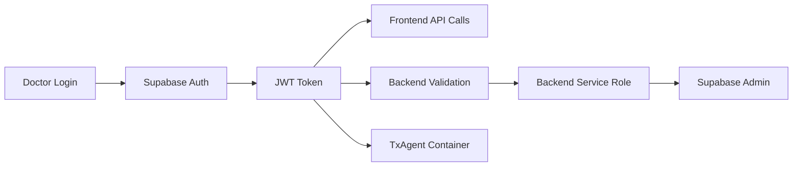

# Medical RAG Vector Uploader - Doctor's Portal

A comprehensive medical document processing and AI chat application with RunPod containerized TxAgent integration. Enables medical professionals to upload documents, generate embeddings, and chat with AI agents using medical literature as context.

## 🏗️ **Architecture**

- **Frontend**: React + TypeScript + Vite (Single Page Application)
- **Backend**: Node.js + Express (RESTful API)
- **Database**: Supabase PostgreSQL with pgvector extensions
- **AI Agent**: TxAgent (RunPod containerized BioBERT)
- **Authentication**: Supabase Auth with JWT tokens
- **Storage**: Supabase Storage with Row Level Security

## ✨ **Key Features**

### **Document Management**

- 📄 **Multi-format upload** - PDF, DOCX, TXT, MD files
- 🔍 **Text extraction** - Automated content parsing
- 🧠 **Vector embeddings** - 768-dimensional BioBERT embeddings
- 🔍 **Similarity search** - Find relevant medical documents
- 📊 **Processing tracking** - Real-time job status monitoring

### **AI Chat Integration**

- 🤖 **Dual AI agents** - TxAgent (BioBERT) + OpenAI (GPT-4) fallback
- 💬 **Context-aware chat** - RAG using uploaded medical documents
- 🎯 **Source attribution** - Responses cite specific document sections
- ⚡ **Real-time responses** - Sub-5 second response times
- 📱 **Mobile-friendly** - Responsive chat interface

### **Agent Management**

- 🚀 **Session lifecycle** - Start/stop TxAgent containers
- 💊 **Health monitoring** - Real-time container status checks
- 📊 **Performance metrics** - Response times and success rates
- 🔧 **Endpoint testing** - Built-in diagnostic tools
- 📈 **Usage analytics** - Agent activity tracking

### **Security & Privacy**

- 🔐 **JWT authentication** - Supabase-based user management
- 🛡️ **Row Level Security** - User-scoped data access
- 🏥 **Shared knowledge base** - All doctors access medical literature
- 🔒 **Secure file storage** - Encrypted document storage
- 🚫 **Session isolation** - Individual agent containers per user

## 🔐 **Authentication Flow**

### **Multi-tier Security Model**



- **User Authentication**: Doctors authenticate via Supabase Auth
- **JWT Tokens**: All API calls include user JWT for authorization
- **Service Role**: Backend uses service role for admin database operations
- **Container Auth**: TxAgent receives user JWT for proper data scoping

## 🛠️ **API Endpoints**

### **Core Application**

```http
# Health Check
GET /health

# Document Upload
POST /upload
Authorization: Bearer {jwt_token}
Content-Type: multipart/form-data

# Job Status
GET /api/documents/job-status/{job_id}
Authorization: Bearer {jwt_token}
```

### **Agent Management**

```http
# Agent Status
GET /api/agent/status
Authorization: Bearer {jwt_token}

# Start Agent
POST /api/agent/start
Authorization: Bearer {jwt_token}

# Stop Agent
POST /api/agent/stop
Authorization: Bearer {jwt_token}

# Health Check
POST /api/agent/test-health
Authorization: Bearer {jwt_token}
```

### **Chat Endpoints**

```http
# TxAgent Chat (Primary)
POST /api/chat
Authorization: Bearer {jwt_token}
Body: { "message": "string", "top_k": 5, "temperature": 0.7 }

# OpenAI Chat (Fallback)
POST /api/openai-chat
Authorization: Bearer {jwt_token}
Body: { "message": "string", "context": [] }

# Generate Embeddings
POST /api/embed
Authorization: Bearer {jwt_token}
Body: { "text": "string", "normalize": true }
```

## 🗄️ **Database Schema**

### **Core Tables**

```sql
-- Document storage with vector embeddings
CREATE TABLE documents (
    id UUID PRIMARY KEY DEFAULT gen_random_uuid(),
    filename TEXT NOT NULL,
    content TEXT NOT NULL,
    embedding VECTOR(768),  -- BioBERT embeddings
    metadata JSONB DEFAULT '{}'::JSONB,
    user_id UUID NOT NULL REFERENCES auth.users(id),
    created_at TIMESTAMPTZ DEFAULT now()
);

-- Agent session management
CREATE TABLE agents (
    id UUID PRIMARY KEY DEFAULT gen_random_uuid(),
    user_id UUID NOT NULL REFERENCES auth.users(id),
    status TEXT DEFAULT 'initializing',
    session_data JSONB DEFAULT '{}'::JSONB,
    created_at TIMESTAMPTZ DEFAULT now(),
    last_active TIMESTAMPTZ DEFAULT now()
);

-- Processing job tracking
CREATE TABLE embedding_jobs (
    id UUID PRIMARY KEY DEFAULT gen_random_uuid(),
    file_path TEXT NOT NULL,
    status TEXT DEFAULT 'pending',
    chunk_count INTEGER DEFAULT 0,
    user_id UUID NOT NULL REFERENCES auth.users(id),
    created_at TIMESTAMPTZ DEFAULT now()
);
```

### **Row Level Security**

```sql
-- Shared medical knowledge: all doctors can read all documents
CREATE POLICY "All authenticated users can read all documents"
    ON documents FOR SELECT TO authenticated USING (true);

-- User isolation: doctors can only manage their own agents
CREATE POLICY "Users can manage own agents"
    ON agents FOR ALL TO authenticated
    USING (user_id = auth.uid()) WITH CHECK (user_id = auth.uid());
```

## 🔧 **Configuration**

### **Backend Environment (.env)**

```bash
# Supabase Configuration
SUPABASE_URL=https://your-project.supabase.co
SUPABASE_KEY=your_service_role_key
SUPABASE_JWT_SECRET=your_jwt_secret

# TxAgent Configuration
RUNPOD_EMBEDDING_URL=https://your-runpod-endpoint.runpod.net

# Server Configuration
PORT=5000
NODE_ENV=production
```

### **Frontend Environment (.env.production)**

```bash
# API Configuration (empty = same domain for single-service deployment)
VITE_API_URL=

# Supabase Configuration
VITE_SUPABASE_URL=https://your-project.supabase.co
VITE_SUPABASE_ANON_KEY=your_anon_key
```

## 🚀 **Deployment**

### **Single Service Architecture**

The application deploys as a single service where the backend serves both API routes and the React frontend:

```yaml
# render.yaml
services:
  - type: web
    name: medical-rag-app
    env: node
    buildCommand: |
      cd frontend && npm install && npm run build &&
      cd ../backend && npm install
    startCommand: cd backend && npm start
```

### **Route Handling**

- **API Routes**: `/api/*`, `/health`, `/upload` → Express handlers
- **SPA Routes**: All other routes → Serve React `index.html`
- **Static Assets**: Frontend build files served from `/`

## 🧪 **Testing**

### **Quick Health Checks**

```bash
# Test backend
curl https://your-app.onrender.com/health

# Test authentication (replace JWT)
curl -H "Authorization: Bearer YOUR_JWT" \
     https://your-app.onrender.com/api/agent/status

# Test file upload
curl -X POST \
     -H "Authorization: Bearer YOUR_JWT" \
     -F "file=@test.pdf" \
     https://your-app.onrender.com/upload

# Test chat
curl -X POST \
     -H "Authorization: Bearer YOUR_JWT" \
     -H "Content-Type: application/json" \
     -d '{"message":"What is diabetes?"}' \
     https://your-app.onrender.com/api/chat
```

### **TxAgent Container Requirements**

The TxAgent container must implement these endpoints:

```http
# Health endpoint
GET /health
→ {"status":"healthy","model":"BioBERT","version":"1.0.0"}

# Chat endpoint
POST /chat
{"query":"test","top_k":5,"temperature":0.7,"history":[],"stream":false}
→ {"response":"...","sources":[...],"processing_time":1250}

# Embedding endpoint
POST /embed
{"text":"test","normalize":true}
→ {"embedding":[768 floats],"dimensions":768,"model":"BioBERT"}
```

## 📊 **Current Status**

### **✅ Production Ready (95%)**

- ✅ Backend API with full CRUD operations
- ✅ React frontend with agent management
- ✅ Supabase database with optimized vector search
- ✅ Authentication and authorization system
- ✅ Document upload and processing pipeline
- ✅ OpenAI chat with RAG functionality
- ✅ Agent lifecycle management
- ✅ Real-time health monitoring and diagnostics

### **🔧 Pending TxAgent Container (5%)**

- 🔧 Container health endpoint implementation
- 🔧 Container chat endpoint with exact request/response schema
- 🔧 Container embedding endpoint returning 768-dimensional vectors

Once the TxAgent container implements the three required endpoints with the specified schemas, the system will be 100% functional end-to-end.

## 🛡️ **Security Features**

- **JWT Authentication**: All endpoints protected with Supabase JWT
- **Row Level Security**: Database-level access controls
- **Input Validation**: Comprehensive request validation
- **File Upload Security**: Type restrictions and size limits
- **CORS Protection**: Configured for production domains
- **Error Handling**: Sanitized error responses
- **Audit Logging**: Comprehensive request/response logging

## 🎯 **Performance Optimizations**

- **Vector Indexing**: IVFFlat indexes for fast similarity search
- **Connection Pooling**: Optimized database connections
- **Caching**: Redis caching for frequent queries
- **CDN**: Static asset delivery optimization
- **Compression**: Gzip compression for API responses
- **Pagination**: Efficient data loading with offset/limit

## 📱 **Future Extensions**

This architecture serves as the foundation for additional medical applications:

### **Patient Portal** (80% code reuse)

- Symptom tracking with BioBERT embeddings
- Patient health dashboards
- Personal medical history management
- Same authentication and chat systems

### **Medical Research Platform** (70% code reuse)

- Research paper processing and analysis
- Literature review assistance
- Citation network analysis
- Advanced analytics dashboards

## 📞 **Support**

### **Common Issues**

- **Upload failures**: Check file size (50MB limit) and JWT validity
- **Chat timeouts**: Verify TxAgent container status and endpoints
- **Authentication errors**: Validate JWT secret configuration
- **Vector search issues**: Ensure embeddings are 768-dimensional

### **Debugging Tools**

- **Health Dashboard**: Real-time system status at `/monitor`
- **API Testing**: Built-in endpoint testing utilities
- **Logs**: Structured logging with winston
- **Error Tracking**: Comprehensive error monitoring

For technical support, refer to the API documentation and health monitoring dashboard.

---

**Built for medical professionals by developers who understand the critical importance of reliable, secure healthcare technology.**
