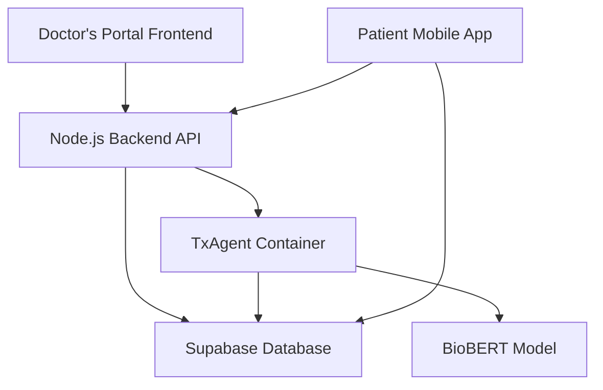

# Symptom Savior - Doctor's Portal

<div align="center">
  
  
  **Smart Medical Document Portal with AI-Powered Chat**
  
  *Built by Vita Nova Software & "the World's Best Hackathon Team"*
  
  [](https://bolt.new)
  [](https://reactjs.org)
  [](https://nodejs.org)
  [](https://supabase.com)
</div>

---

## 🏥 **Project Overview**

**Symptom Savior** is a revolutionary medical AI platform designed to enhance healthcare delivery through intelligent document processing and AI-powered medical consultations. The **Doctor's Portal** serves as the professional interface for healthcare providers to upload medical documents and interact with the containerized TxAgent AI system.

This application is part of a larger ecosystem that includes:
- **Doctor's Portal** (this repository) - Document management and AI chat interface
- **Patient Mobile App** (companion application) - Patient symptom tracking and consultations
- **TxAgent Container** - GPU-accelerated BioBERT medical AI processing

### 🎯 **Key Features**

- **📄 Medical Document Processing**: Upload and process PDF, DOCX, TXT, and MD medical documents
- **🤖 AI-Powered Chat**: Interact with BioBERT-powered medical AI for document analysis
- **🔒 Secure Authentication**: JWT-based authentication with row-level security
- **⚡ Real-time Processing**: Asynchronous document processing with status monitoring
- **🏥 Healthcare-Focused**: Designed specifically for medical professionals and workflows
- **📱 Responsive Design**: Works seamlessly across desktop and mobile devices

---

## 🏗️ **Architecture Overview**

### **System Components**



### **Technology Stack**

#### **Frontend (React/Vite)**
- **Framework**: React 18 with TypeScript
- **Build Tool**: Vite for fast development and optimized builds
- **Styling**: Tailwind CSS with custom medical theme
- **State Management**: React Context API with custom hooks
- **Authentication**: Supabase Auth with JWT tokens
- **UI Components**: Custom component library with accessibility features

#### **Backend (Node.js/Express)**
- **Runtime**: Node.js with Express framework
- **Database**: Supabase PostgreSQL with pgvector extension
- **Authentication**: JWT validation with row-level security
- **File Processing**: Multer for file uploads, integration with TxAgent
- **API Design**: RESTful endpoints with comprehensive error handling
- **Deployment**: Render.com with environment-based configuration

#### **AI Processing (TxAgent Container)**
- **Model**: BioBERT (dmis-lab/biobert-v1.1) for medical text understanding
- **Embeddings**: 768-dimensional vectors for semantic search
- **Hardware**: GPU-accelerated processing on RunPod infrastructure
- **API**: FastAPI with comprehensive medical document processing
- **Integration**: Direct communication with backend for real-time processing

#### **Database (Supabase)**
- **Core**: PostgreSQL with pgvector for vector similarity search
- **Security**: Row-level security (RLS) for data isolation
- **Storage**: Supabase Storage for document files
- **Real-time**: Real-time subscriptions for status updates
- **Backup**: Automated backups and point-in-time recovery

---

## 🚀 **Getting Started**

### **Prerequisites**

- **Node.js** 18+ and npm
- **Supabase** account and project
- **TxAgent Container** deployed on RunPod (optional for development)
- **OpenAI API Key** (fallback for AI processing)

### **Environment Setup**

1. **Clone the Repository**
   ```bash
   git clone <repository-url>
   cd symptom-savior-doctors-portal
   ```

2. **Install Dependencies**
   ```bash
   # Backend dependencies
   cd backend
   npm install
   
   # Frontend dependencies
   cd ../frontend
   npm install
   ```

3. **Environment Configuration**

   **Backend (.env)**
   ```env
   # Supabase Configuration
   SUPABASE_URL=https://your-project.supabase.co
   SUPABASE_KEY=your_service_role_key_here
   SUPABASE_JWT_SECRET=your_jwt_secret_here
   
   # Server Configuration
   PORT=8000
   NODE_ENV=development
   
   # TxAgent Container (Optional)
   RUNPOD_EMBEDDING_URL=https://your-runpod-url.proxy.runpod.net
   RUNPOD_EMBEDDING_KEY=your_runpod_api_key_here
   
   # OpenAI Fallback (Optional)
   OPENAI_API_KEY=your_openai_api_key_here
   
   # Debug Logging
   BACKEND_DEBUG_LOGGING=true
   ```

   **Frontend (.env)**
   ```env
   VITE_SUPABASE_URL=https://your-project.supabase.co
   VITE_SUPABASE_ANON_KEY=your_supabase_anon_key_here
   VITE_API_URL=http://localhost:8000
   ```

4. **Database Setup**
   ```bash
   # Run Supabase migrations
   cd supabase
   npx supabase db reset
   ```

5. **Start Development Servers**
   ```bash
   # Start backend (Terminal 1)
   cd backend
   npm run dev
   
   # Start frontend (Terminal 2)
   cd frontend
   npm run dev
   ```

6. **Access the Application**
   - **Frontend**: http://localhost:5173
   - **Backend API**: http://localhost:8000
   - **Health Check**: http://localhost:8000/health

---

## 📚 **API Documentation**

### **Core Endpoints**

#### **Authentication**
- **POST** `/auth/login` - User authentication
- **POST** `/auth/register` - User registration
- **GET** `/auth/user` - Get current user info

#### **Document Management**
- **POST** `/upload` - Upload medical documents
- **GET** `/api/documents` - List user documents
- **DELETE** `/api/documents/:id` - Delete document

#### **AI Chat Interface**
- **POST** `/api/chat` - Chat with TxAgent (BioBERT)
- **POST** `/api/openai-chat` - Chat with OpenAI (fallback)
- **POST** `/api/embed` - Generate text embeddings

#### **Agent Management**
- **POST** `/api/agent/start` - Start TxAgent session
- **POST** `/api/agent/stop` - Stop TxAgent session
- **GET** `/api/agent/status` - Get agent status
- **POST** `/api/agent/health-check` - Detailed health check

#### **System Health**
- **GET** `/health` - System health status

### **Request/Response Examples**

#### **Document Upload**
```bash
curl -X POST "http://localhost:8000/upload" \
  -H "Authorization: Bearer <jwt_token>" \
  -F "file=@medical-document.pdf"
```

#### **Chat with TxAgent**
```bash
curl -X POST "http://localhost:8000/api/chat" \
  -H "Authorization: Bearer <jwt_token>" \
  -H "Content-Type: application/json" \
  -d '{
    "message": "What are the symptoms of diabetes?",
    "top_k": 5,
    "temperature": 0.7
  }'
```

---

## 🗄️ **Database Schema**

### **Core Tables**

#### **documents**
```sql
CREATE TABLE public.documents (
  id UUID PRIMARY KEY DEFAULT gen_random_uuid(),
  filename TEXT,
  content TEXT NOT NULL,
  embedding VECTOR(768),  -- BioBERT embeddings
  metadata JSONB DEFAULT '{}'::JSONB,
  user_id UUID NOT NULL REFERENCES auth.users(id) ON DELETE CASCADE,
  created_at TIMESTAMPTZ DEFAULT now()
);
```

#### **agents**
```sql
CREATE TABLE public.agents (
  id UUID PRIMARY KEY DEFAULT gen_random_uuid(),
  user_id UUID NOT NULL REFERENCES auth.users(id) ON DELETE CASCADE,
  status TEXT DEFAULT 'initializing',
  session_data JSONB DEFAULT '{}'::JSONB,
  created_at TIMESTAMPTZ DEFAULT now(),
  last_active TIMESTAMPTZ DEFAULT now(),
  terminated_at TIMESTAMPTZ
);
```

#### **embedding_jobs**
```sql
CREATE TABLE public.embedding_jobs (
  id UUID PRIMARY KEY DEFAULT gen_random_uuid(),
  file_path TEXT NOT NULL,
  status TEXT DEFAULT 'pending',
  metadata JSONB DEFAULT '{}'::JSONB,
  chunk_count INTEGER DEFAULT 0,
  error TEXT,
  user_id UUID NOT NULL REFERENCES auth.users(id) ON DELETE CASCADE,
  created_at TIMESTAMPTZ DEFAULT now(),
  updated_at TIMESTAMPTZ DEFAULT now()
);
```

### **Security Features**
- **Row Level Security (RLS)**: All tables enforce user-based data isolation
- **JWT Authentication**: Secure token-based authentication
- **Foreign Key Constraints**: Data integrity and cascade deletions
- **Vector Indexing**: Optimized similarity search with IVFFlat

---

## 🔧 **TxAgent Integration**

### **Container Communication**

The Doctor's Portal communicates with the TxAgent container through these endpoints:

#### **Document Processing Flow**
1. **Upload**: Doctor uploads document via frontend
2. **Storage**: Backend stores file in Supabase Storage
3. **Processing**: Backend calls TxAgent `/process-document` endpoint
4. **Embedding**: TxAgent generates BioBERT embeddings
5. **Storage**: Embeddings stored in database with RLS

#### **Chat Flow**
1. **Query**: Doctor submits medical question
2. **Processing**: Backend calls TxAgent `/chat` endpoint
3. **Search**: TxAgent performs vector similarity search
4. **Response**: AI generates contextual medical response
5. **Display**: Response shown with source citations

### **TxAgent API Endpoints**

- **POST** `/process-document` - Process uploaded medical documents
- **POST** `/chat` - Generate AI responses with medical context
- **POST** `/embed` - Generate BioBERT embeddings for text
- **GET** `/health` - Container health and status

---

## 🧪 **Testing**

### **Development Testing**
```bash
# Run backend tests
cd backend
npm test

# Run frontend tests
cd frontend
npm test

# Run integration tests
npm run test:integration
```

### **API Testing**
Use the included Postman collection for comprehensive API testing:
- Authentication flows
- Document upload and processing
- Chat functionality
- Agent management
- Error handling scenarios

### **Health Checks**
```bash
# Backend health
curl http://localhost:8000/health

# TxAgent health (if running)
curl https://your-runpod-url.proxy.runpod.net/health
```

---

## 🚀 **Deployment**

### **Production Deployment**

#### **Backend (Render.com)**
1. Connect GitHub repository to Render
2. Configure environment variables
3. Deploy with automatic builds on push

#### **Frontend (Netlify/Vercel)**
1. Build production bundle: `npm run build`
2. Deploy `dist` folder to hosting platform
3. Configure redirects for SPA routing

#### **Database (Supabase)**
- Managed PostgreSQL with automatic scaling
- Built-in backups and monitoring
- Production-ready security features

### **Environment Variables (Production)**
```env
# Backend
SUPABASE_URL=https://your-project.supabase.co
SUPABASE_KEY=your_production_service_role_key
SUPABASE_JWT_SECRET=your_production_jwt_secret
RUNPOD_EMBEDDING_URL=https://your-production-runpod-url
OPENAI_API_KEY=your_production_openai_key
NODE_ENV=production

# Frontend
VITE_SUPABASE_URL=https://your-project.supabase.co
VITE_SUPABASE_ANON_KEY=your_production_anon_key
VITE_API_URL=https://your-backend-domain.com
```

---

## 📊 **Monitoring & Analytics**

### **System Monitoring**
- **Health Endpoints**: Real-time system status monitoring
- **Error Tracking**: Comprehensive error logging and alerting
- **Performance Metrics**: Response times and throughput monitoring
- **User Analytics**: Usage patterns and feature adoption

### **Logging**
- **Request Logging**: All API requests with user context
- **Error Logging**: Detailed error information with stack traces
- **Performance Logging**: Processing times and resource usage
- **Security Logging**: Authentication events and access patterns

---

## 🔒 **Security**

### **Authentication & Authorization**
- **JWT Tokens**: Secure token-based authentication
- **Row Level Security**: Database-level user data isolation
- **CORS Configuration**: Proper cross-origin request handling
- **Input Validation**: Comprehensive request validation

### **Data Protection**
- **Encryption**: Data encrypted in transit and at rest
- **Access Controls**: Role-based access control (RBAC)
- **Audit Logging**: Complete audit trail for all operations
- **HIPAA Compliance**: Healthcare data protection standards

---

## 🤝 **Contributing**

### **Development Workflow**
1. Fork the repository
2. Create a feature branch: `git checkout -b feature/amazing-feature`
3. Commit changes: `git commit -m 'Add amazing feature'`
4. Push to branch: `git push origin feature/amazing-feature`
5. Open a Pull Request

### **Code Standards**
- **TypeScript**: Strict type checking enabled
- **ESLint**: Code linting with medical-specific rules
- **Prettier**: Consistent code formatting
- **Testing**: Comprehensive test coverage required

### **Documentation**
- Update README.md for new features
- Add JSDoc comments for new functions
- Update API documentation for endpoint changes
- Include migration guides for breaking changes

---

## 📞 **Support & Contact**

### **Development Team**
- **Organization**: Vita Nova Software
- **Team**: "the World's Best Hackathon Team"
- **Platform**: Built with [Bolt](https://bolt.new)

### **Technical Support**
- **Issues**: GitHub Issues for bug reports and feature requests
- **Documentation**: Comprehensive docs in `/docs` folder
- **API Reference**: OpenAPI specification available
- **Community**: Join our Discord for real-time support

### **Healthcare Compliance**
- **HIPAA**: Compliant with healthcare data protection standards
- **Security**: Regular security audits and penetration testing
- **Certification**: SOC 2 Type II compliance in progress

---

## 📄 **License**

This project is licensed under the MIT License - see the [LICENSE](LICENSE) file for details.

---

## 🙏 **Acknowledgments**

- **Bolt Platform**: For providing the development environment
- **Supabase**: For the robust backend infrastructure
- **BioBERT Team**: For the medical language model
- **Open Source Community**: For the amazing tools and libraries
- **Healthcare Professionals**: For their invaluable feedback and guidance

---

<div align="center">
  <p><strong>Built with ❤️ by Vita Nova Software & "the World's Best Hackathon Team"</strong></p>
  <p><em>Powered by Bolt - Revolutionizing Healthcare with AI</em></p>
</div>